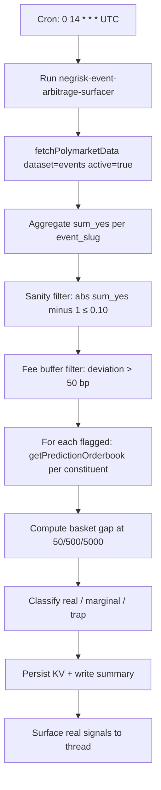

# NegRisk Event Arbitrage Surfacer

Scheduled daily scan that applies the sum-of-yes = $1.00 fair-pricing invariant to active Polymarket negRisk events and depth-walks each candidate's constituents to verify the basket clears at meaningful size. Surfaces only events classified as `real` (gap clears ≥ 50 bp at $500/constituent) into a thread message, with full `marginal`/`trap` breakdown persisted to KV.

## What it does

- Runs the `negrisk-event-arbitrage-surfacer` workflow once per day at 14:00 UTC.
- Fetches active Polymarket events, registers the auto-materialised SQL table, and aggregates `sum_yes` per event.
- Applies a sanity filter (`|sum_yes - 1.0| ≤ 0.10`) to exclude multi-option non-exclusive structures that are not real negRisk events.
- Flags events whose top-of-book sum deviates from $1.00 by more than the fee buffer (default 50 bp).
- For each flagged event, calls `getPredictionOrderbook` per constituent at $50, $500, and $5,000 basket sizes.
- Classifies each event as `real`, `marginal`, or `trap` based on the depth-aware basket fill at each size.
- Persists the day's scan to KV (`negrisk:latest_classified`) and surfaces only `real` signals to the thread.

## Capability contract

- Trigger: cron `0 14 * * *` in `UTC`.
- Inputs:
  - workflowId: `negrisk-event-arbitrage-surfacer`
  - limit: 100
  - feeBufferBp: 50
  - minConstituents: 3
  - maxAbsDeviation: 0.10
  - minEventVolumeUsd: 0
  - depthSize1: 50
  - depthSize2: 500
  - depthSize3: 5000
  - maxEventsToWalk: 20
- Outputs:
  - real-signal list with event slug, gap-vs-size table, throttle constituent, and event lifetime volume
  - full real/marginal/trap classification persisted to `negrisk:latest_classified` KV
  - run artifacts at `/workspace/scratch/negrisk_flagged.json`, `negrisk_classified.json`, `negrisk_summary.md`
- Side effects:
  - reads Polymarket gamma + CLOB/orderbook data
  - writes KV state (`negrisk:*` namespace) and local run artifacts
  - does NOT submit orders, does NOT manage Struct watchers
- Failure modes:
  - no negRisk events flagged on a given run (expected on quiet days)
  - constituent missing `clob_token_ids` (skipped silently with warning in artifact)
  - `getPredictionOrderbook` timeout or stale data (event flagged as marginal due to incomplete walk)
  - sum_yes deviation present but driven by a single illiquid constituent (caught by depth-walk classification)
- Strategy state transitions:
  - idle -> fetch on cron tick
  - fetch -> aggregate after `polymarket_negrisk_raw` registered
  - aggregate -> flagged-candidates after sanity filter + fee-buffer check
  - flagged-candidates -> classified after depth-walk
  - classified -> surfaced once real signals are written; idle until next tick

## Schedule diagram

## Setup

1. Install the workflow artifact from `workflows/negrisk-event-arbitrage-surfacer/references/negrisk-event-arbitrage-surfacer@latest.ts`.
2. Schedule the workflow at `0 14 * * *` in `UTC` (after Polymarket morning activity, before US close).
3. **No operator setup required.** The workflow self-bootstraps the Polymarket events table on every run via `exec` (limit=5 events, ~2s overhead) and discovers it via `sqlite_master`. First run produces the same artifacts as steady-state runs.
4. Start with the documented defaults. Tighten `minEventVolumeUsd` to a higher floor (e.g. 1,000,000) if you want to apply a flagship-tier filter at this layer rather than via the companion volume-tier recipe.
5. Review `/workspace/scratch/negrisk_summary.md` after each run for real signals; `negrisk_classified.json` for the full breakdown.
6. The recipe is read/surface only. Promoting a flagged real signal to a live trade is handled by the companion `recipe-negrisk-maker-executor` recipe, which consumes `negrisk:latest_classified` from KV.

## Quick Copy Prompt (Ask Gina)

~~~text
Create a scheduled workflow recipe:
- Name: NegRisk Event Arbitrage Surfacer
- Execute with agent: predictions
- Workflow: negrisk-event-arbitrage-surfacer@latest
- Schedule: 0 14 * * *
- Timezone: UTC
- Task: Scan active Polymarket negRisk events, apply sum_yes = 1.0 fair-pricing invariant with a 0.10 sanity band, depth-walk constituents at $50/$500/$5000 per market, surface only events that clear 50 bp at $500/constituent. Persist full real/marginal/trap classification to KV negrisk:latest_classified.
- Risk rules: limit 100, feeBufferBp 50, minConstituents 3, maxAbsDeviation 0.10, depth sizes 50/500/5000, maxEventsToWalk 20.

Then return:
- Ready-to-run workflow recipe config
- Today's real signals with gap-vs-size table and throttle constituent
- Marginal and trap summaries
~~~

## Security and permissions

- `security.permissions`: read-market-data, read-orderbook, write-run-artifacts, write-local-state-file.
- Read/surface only — no trade execution, no Struct watcher mutation, no on-chain wallet activity.
- Safe to run on a daily schedule. The output is informational; no action automatically follows from a surfaced signal.
- Do not persist Privy tokens, raw secret-bearing provider logs, or auth headers in artifacts.

## Evidence

- Source recipe: this file.
- Workflow source: `workflows/negrisk-event-arbitrage-surfacer/references/negrisk-event-arbitrage-surfacer@latest.ts`.
- Build-date dry-run: `runs/dryrun-negrisk-2026-05-30.log` — captured live against the Gina MCP, shows World Cup negRisk event (60 constituents, sum_yes = 1.027 → +270 bp deviation, ev_vol $1.30B) and constituent depth-walk on Spain YES (zero slippage at $5,000 basket size, $14.76M of ask depth).
- Underlying methodology: [polymarket-edge](https://github.com/harrywinter06-code/polymarket-edge) `microstructure.py` + `book_depth.py` (500-event scan, count-vs-dollar reframe, World Cup case study).

## Backlinks

- [Workflow](../../workflows/negrisk-event-arbitrage-surfacer/README.md)
- [Strategy](../../strategies/predictions/strategy-polymarket-negrisk-basket-arbitrage.md)
- [Pack README](../../README.md)
- Category: `recipes/predictions/` (resolves to `docs/categories/recipes.md` when merged into `awesome-gina`)
