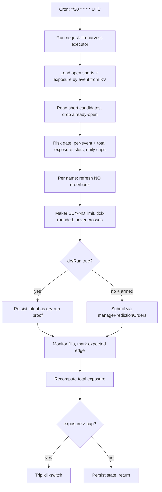

# NegRisk FLB Harvest Executor

Consumes the FLB scanner's short list and expresses each short as a maker **BUY of the NO token** (the
only collateralised way to short an overpriced longshot YES on Polymarket's CLOB), under a
diversification-first risk model. The trade-capable layer of Pack 3; defaults to `dryRun: true`.

## What it does

- Runs every 30 minutes at `*/30 * * * *` UTC. (Slower than Pack 2 — FLB positions are held to event
  resolution, not requoted intraday.)
- Reads `flb:eligible_baskets` from KV; drops names already shorted; re-checks the conservative-edge
  floor at consume time.
- Applies diversification-first risk caps: **per-event exposure cap** (within one negRisk event the
  shorted names are mutually exclusive — concentration there is a single correlated bet), total
  exposure cap, max open positions, daily notional, daily-loss kill-switch.
- For each allowed name, refreshes the **NO-token** orderbook and computes a maker BUY-NO limit
  (improves the bid by the offset, tick-rounded, clamped so it never crosses the ask — maker-only).
- In dryRun, persists the intent as a reviewable proof. In live mode (after operator arming), submits
  via `managePredictionOrders` (production lines commented out in the as-shipped workflow).
- Books **expected edge** on fill — a mark-to-model EV at central gamma. **Realised P&L (including the
  fat tail when a shorted longshot wins) only materialises at event resolution**, so the primary risk
  control is exposure, not realised daily P&L.
- Recomputes total live exposure each cycle and trips the kill-switch on breach.

## Capability contract

- Trigger: cron `*/30 * * * *` in `UTC`.
- Inputs:
  - workflowId: `negrisk-flb-harvest-executor`
  - signalKey: `flb:eligible_baskets`
  - collateralPerNameUsd: 25
  - maxOpenPositions: 8
  - maxExposurePerEventUsd: 50
  - maxTotalExposureUsd: 300
  - maxDailyNotionalUsd: 200
  - maxDailyLossUsd: 50
  - makerLimitPriceOffsetBp: 5
  - minSellEdgeConservative: 0.0
  - dryRun: true
- Outputs:
  - per-cycle intents at `/workspace/scratch/flb_cycle.json`, summary at `flb_summary.md`
  - per-position state at `flb:positions:<no_token>` KV
  - `flb:exposure_state`, `flb:daily_notional:<date>`, `flb:kill_switch_state` KV
- Side effects: reads sibling-recipe KV (`flb:*`); writes KV under `flb:*`; in live mode submits Polymarket maker BUY-NO orders per allowed name.
- Failure modes:
  - empty eligibility KV (idle return)
  - risk-gate block: kill-switch tripped, per-event or total exposure cap reached, daily caps reached (logged, no shorts)
  - invalid NO orderbook (name excluded this cycle)
- Strategy state transitions:
  - idle -> evaluating on cron tick
  - evaluating -> shorting when a candidate passes the exposure gate
  - shorting -> filled when the NO orderbook crosses our limit
  - filled -> held to resolution (expected edge marked; realised P&L deferred)
  - any -> killed when total exposure cap breached

## Schedule diagram

## Setup

1. Install the workflow artifact at `workflows/negrisk-flb-harvest-executor/references/negrisk-flb-harvest-executor@latest.ts`.
2. Install the companion scanner recipe first; this executor idles if `flb:eligible_baskets` is empty.
3. Schedule at `*/30 * * * *` UTC.
4. **Start with the defaults: `dryRun: true`, `collateralPerNameUsd: 25`. Review dry-run cycle proofs at
   `/workspace/scratch/flb_cycle.json` over at least one observation window before considering live.**
5. To enable production submission (operator-arming step):
   - Edit the workflow TS and set `const dryRun = false` in both `plan_and_short` and `monitor_and_mark`.
   - Uncomment the `managePredictionOrders` create block in `plan_and_short` (commented as defense-in-depth).
   - Set `collateralPerNameUsd` to a small first-live value.
   - Verify Polymarket account has USDC.e balance >= `maxTotalExposureUsd`.
   - **Understand positions are held to resolution and the tail is fat** — confirm you accept it before arming.

## Quick Copy Prompt (Ask Gina)

~~~text
Create a scheduled workflow recipe:
- Name: NegRisk FLB Harvest Executor
- Execute with agent: predictions
- Workflow: negrisk-flb-harvest-executor@latest
- Schedule: */30 * * * *
- Timezone: UTC
- Task: Consume the FLB short list from KV flb:eligible_baskets. For each name not already shorted, apply diversification-first risk caps (per-event exposure cap, total exposure cap, max open positions, daily notional, daily-loss kill-switch). Express the short as a maker BUY of the NO token: refresh the NO orderbook, post a maker BUY-NO limit (improve the bid, tick-rounded, never cross the ask). Persist intents as dry-run proof. Monitor fills, book expected edge (mark-to-model, central gamma; realised P&L only at event resolution), recompute total exposure, trip the kill-switch on exposure breach.
- Risk rules: collateralPerNameUsd 25, maxOpenPositions 8, maxExposurePerEventUsd 50, maxTotalExposureUsd 300, maxDailyNotionalUsd 200, maxDailyLossUsd 50, makerLimitPriceOffsetBp 5, dryRun true.

Then return:
- Ready-to-run workflow recipe config
- Today's short intents (or live order summaries)
- Open shorts with exposure by event
- Total exposure at risk and kill-switch state
~~~

## Security and permissions

- `security.permissions`: read-market-data, read-orderbook, read-position, place-prediction-trade, close-prediction-position, write-run-artifacts, write-local-state-file, write-agentfs-state.
- Trade-capable; production submission lines are commented in the as-shipped workflow.
- Diversification-first: per-event exposure cap is the headline control (within-event names are
  correlated). Kill-switch auto-trips on total-exposure breach; operator must reset `flb:kill_switch_state`.
- Live promotion requires the explicit edits in Setup #5. Do not toggle `dryRun: false` without all of them.
- Do not persist Privy tokens, raw secret-bearing provider logs, or auth headers in artifacts.

## Evidence

- Source recipe: this file.
- Workflow source: `workflows/negrisk-flb-harvest-executor/references/negrisk-flb-harvest-executor@latest.ts`.
- Live run: `run_mpu8xb3jhmvuoi` (consumed 10 candidates, per-event cap correctly throttled to 2 shorts in dry-run) — see [TEST_RESULTS_FLB.md](../../runs/TEST_RESULTS_FLB.md).
- Economic model: [`PROFITABILITY_ANALYSIS_FLB.md`](../../PROFITABILITY_ANALYSIS_FLB.md).

## Backlinks

- [Workflow](../../workflows/negrisk-flb-harvest-executor/README.md)
- [Strategy](../../strategies/predictions/strategy-polymarket-negrisk-flb-harvest.md)
- [Pack README](../../README.md)
- Category: `recipes/predictions/` (resolves to `docs/categories/recipes.md` when merged into `awesome-gina`)
