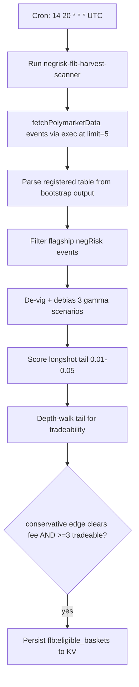

# NegRisk FLB Harvest Scanner

Scheduled daily scan that surfaces the overpriced longshot tail of flagship negRisk baskets for the
companion FLB executor. Read/surface only.

## What it does

- Runs the `negrisk-flb-harvest-scanner` workflow once per day at 20:14 UTC.
- Self-bootstraps the Polymarket events table (no operator setup), parsing the registered table name
  directly from the bootstrap output (robust against `sqlite_master` ROWID mis-ordering).
- Filters to flagship negRisk events: `|sum_yes - 1.0| <= maxAbsDeviation` AND lifetime volume >= $1M
  AND >= `minConstituents` priced constituents. FLB fires when the basket sums to ~1 (no Pack-1 arb)
  but the internal allocation is biased.
- De-vigs each basket to `q_i = price_i / sum`, then debiases `p_true_i = q_i^gamma / sum(q^gamma)` at
  three scenarios (gamma 1.0 / 1.10 / 1.20).
- Scores the longshot tail (band `longshotFloor <= price <= longshotCeiling`, default 0.01-0.05):
  per-share sell edge, edge as % of shorted notional AND % of collateral deployed, and the tail's
  collective win probability.
- Depth-walks the tail to confirm a live, non-degenerate orderbook (cannot short a dead book).
- Eligibility gate: the **conservative (gamma=1, measurable)** tail edge must clear the fee buffer AND
  at least `minTailConstituents` tail names must be tradeable. The behavioural upside (gamma>1) is
  reported but never gates.
- Persists eligible baskets + a per-name short list (incl. the NO token) to `flb:eligible_baskets` KV.

## Capability contract

- Trigger: cron `14 20 * * *` in `UTC`.
- Inputs:
  - workflowId: `negrisk-flb-harvest-scanner`
  - limit: 500
  - minConstituents: 4
  - maxAbsDeviation: 0.10
  - minEventVolumeUsd: 1000000
  - longshotCeiling: 0.05
  - longshotFloor: 0.01
  - minTailConstituents: 3
  - gammaConservative: 1.0
  - gammaCentral: 1.10
  - gammaAggressive: 1.20
  - feeBufferBp: 50
  - depthSizeUsd: 50
  - maxConstituentsToWalk: 100
- Outputs:
  - `flb:eligible_baskets` KV (per-basket edge triple + per-name short list with NO token)
  - run artifacts at `/workspace/scratch/flb_scored.json`, `flb_eligible.json`, `flb_eligibility.md`
- Side effects: reads Polymarket gamma + CLOB/orderbook; writes KV (`flb:*`) and local artifacts; does NOT submit orders.
- Failure modes:
  - no eligible baskets (expected most days — flagship + tradeable-tail is a narrow filter)
  - `getPredictionOrderbook` timeout (constituent excluded)
  - basket outside the negRisk sanity band (excluded as non-negRisk)

## Schedule diagram

## Setup

1. Install the workflow artifact from `workflows/negrisk-flb-harvest-scanner/references/negrisk-flb-harvest-scanner@latest.ts`.
2. Validate with `workflow validate negrisk-flb-harvest-scanner`.
3. Schedule at `14 20 * * *` UTC (offset from Packs 1/2 to avoid host-tool contention).
4. **No operator setup required.** Self-bootstrap pattern.
5. Review `/workspace/scratch/flb_eligibility.md` after each run. Note: the conservative column is the
   only venue-measurable edge; central/aggressive are literature-anchored (see PROFITABILITY_ANALYSIS_FLB.md).
6. Read/surface only. Capital deployment is handled by `recipe-negrisk-flb-harvest-executor`.

## Quick Copy Prompt (Ask Gina)

~~~text
Create a scheduled workflow recipe:
- Name: NegRisk FLB Harvest Scanner
- Execute with agent: predictions
- Workflow: negrisk-flb-harvest-scanner@latest
- Schedule: 14 20 * * *
- Timezone: UTC
- Task: Scan flagship Polymarket negRisk baskets (sum_yes ~ 1.0, lifetime volume >= $1M). De-vig each to implied probabilities, debias under a horse-racing power model (p_true = q^gamma / sum q^gamma) at gamma 1.0/1.10/1.20. Score the longshot tail (0.01 <= price <= 0.05): per-share sell edge, edge as % of shorted notional and % of collateral, collective tail win-prob. Depth-walk the tail for tradeability. Surface only baskets whose conservative (gamma=1, overround-only) tail edge clears the fee buffer AND have >= 3 tradeable tail names. Persist to KV flb:eligible_baskets with a per-name short list including the NO token.
- Risk rules: limit 500, minConstituents 4, maxAbsDeviation 0.10, minEventVolumeUsd 1000000, longshotCeiling 0.05, longshotFloor 0.01, minTailConstituents 3, gammaCentral 1.10, feeBufferBp 50, depthSizeUsd 50.

Then return:
- Ready-to-run workflow recipe config
- Today's eligible baskets with three-scenario tail edge
- Per-name short list (slug, yes_price, NO token, sell edge)
- Filtered-out counts
~~~

## Security and permissions

- `security.permissions`: read-market-data, read-orderbook, write-run-artifacts, write-local-state-file.
- Read/surface only — no trade execution, no on-chain wallet activity.
- Safe to run on a daily schedule; output is informational.
- Do not persist Privy tokens, raw secret-bearing provider logs, or auth headers in artifacts.

## Evidence

- Source recipe: this file.
- Workflow source: `workflows/negrisk-flb-harvest-scanner/references/negrisk-flb-harvest-scanner@latest.ts`.
- Live run (real signal): `run_mpu8uvavqxig7b` (1 eligible basket, 10 short candidates) — see [TEST_RESULTS_FLB.md](../../runs/TEST_RESULTS_FLB.md).
- Underlying anomaly: favourite-longshot bias (Thaler-Ziemba; modern Polymarket/Kalshi calibration literature).

## Backlinks

- [Workflow](../../workflows/negrisk-flb-harvest-scanner/README.md)
- [Strategy](../../strategies/predictions/strategy-polymarket-negrisk-flb-harvest.md)
- [Pack README](../../README.md)
- Category: `recipes/predictions/` (resolves to `docs/categories/recipes.md` when merged into `awesome-gina`)
