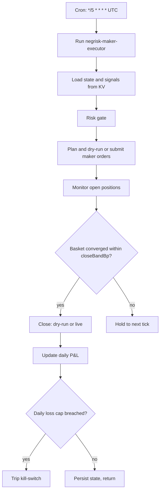

# NegRisk Maker Arbitrage Executor

Consumes depth-verified negRisk arbitrage signals produced by the upstream surfacer and tier-filter recipes, plans per-constituent maker orders under risk caps, persists order intents (or submits them when explicitly armed), and manages open positions through basket convergence. The trade-capable layer of the pack; defaults to `dryRun: true` and a $0 first-live notional.

## What it does

- Runs every 5 minutes at `*/5 * * * *` UTC to track basket lifecycle responsively (open → fill → converge → close → realised P&L).
- Reads `negrisk:latest_classified` and `voltier:latest_surfaced` from KV; identifies real signals not already positioned.
- Applies risk caps: per-event capital, max simultaneous open positions, max daily notional, max daily loss with auto-tripping kill-switch.
- Computes per-constituent maker limit-price intents at `bestBid + 5bp` (sell-side basket) or `bestAsk - 5bp` (buy-side basket).
- In dryRun, persists the order intent as a reviewable proof and surfaces a cycle summary.
- In live mode (after operator arming), submits maker orders via `managePredictionOrders` (production submission lines are intentionally stubbed in the as-shipped workflow; going live requires uncommenting them).
- Monitors open positions, closes when basket `sum_yes` converges within `closeBandBp` of fair value.
- Aggregates realised P&L per day and trips the kill-switch on daily-loss-cap breach.

## Capability contract

- Trigger: cron `*/5 * * * *` in `UTC`.
- Inputs:
  - workflowId: `negrisk-maker-executor`
  - signalKeyArb: `negrisk:latest_classified`
  - signalKeyTier: `voltier:latest_surfaced`
  - maxCapitalPerEventUsd: 5000
  - maxOpenPositions: 3
  - maxDailyNotionalUsd: 20000
  - maxDailyLossUsd: 200
  - makerOnly: true
  - makerLimitPriceOffsetBp: 5
  - closeBandBp: 25
  - dryRun: true
  - notionalUsdOverride: 0
- Outputs:
  - per-cycle intent + result at `/workspace/scratch/executor_cycle.json`
  - human-readable summary at `/workspace/scratch/executor_summary.md`
  - per-event position state at `executor:positions:<event_slug>` KV
  - rolling daily P&L at `executor:daily_pnl:<YYYY-MM-DD>` KV
- Side effects:
  - reads sibling-recipe KV state (`negrisk:*`, `voltier:*`)
  - writes KV under `executor:*` namespace
  - in live mode: submits Polymarket maker orders and closes positions on basket convergence
- Failure modes:
  - empty signal KV (idle return)
  - risk-gate block (logged, no orders placed)
  - maker order rejection (default: hold to next tick)
  - kill-switch tripped (no new orders until operator resets)
  - stale orderbook on close attempt (held to next tick)
- Strategy state transitions:
  - idle -> evaluating on cron tick
  - evaluating -> opening when a new real signal passes risk gates
  - opening -> open when all constituent maker orders fill
  - open -> closing when basket converges within closeBandBp
  - closing -> closed after all close-out orders fill and P&L computed
  - any -> killed when daily-loss cap breached

## Schedule diagram

## Setup

1. Install the workflow artifact at `workflows/negrisk-maker-executor/references/negrisk-maker-executor@latest.ts`.
2. Install the companion surfacer recipe (`recipe-negrisk-event-arbitrage-surfacer`) and tier-filter recipe (`recipe-volume-tier-trap-filter`) first. This executor consumes their KV state and idles if both are empty.
3. Schedule this recipe at `*/5 * * * *` in `UTC`.
4. **Start with the defaults: `dryRun: true`, `notionalUsdOverride: 0`. Verify dry-run cycle proofs at `/workspace/scratch/executor_cycle.json` and the executor summary over at least one observation window (≥ 7 days) before considering live promotion.**
5. To enable production submission (operator-arming step):
   - Edit the workflow TS at `workflows/negrisk-maker-executor/references/negrisk-maker-executor@latest.ts` and uncomment the `managePredictionOrders` and `closePredictionPosition` blocks in steps `plan_and_execute` and `monitor_and_close`. The as-shipped artifact has these commented as a defense-in-depth so going live requires an explicit traceable edit.
   - Set `dryRun: false` in the recipe inputs.
   - Set `notionalUsdOverride` to a small first-live value (e.g. $100).
   - Verify Polymarket account has USDC.e balance ≥ `maxDailyNotionalUsd`.
   - Monitor the first cycle end-to-end before relaxing.

## Quick Copy Prompt (Ask Gina)

~~~text
Create a scheduled workflow recipe:
- Name: NegRisk Maker Arbitrage Executor
- Execute with agent: predictions
- Workflow: negrisk-maker-executor@latest
- Schedule: */5 * * * *
- Timezone: UTC
- Task: Consume depth-verified negRisk arbitrage signals from KV (negrisk:latest_classified preferred; fall back to voltier:latest_surfaced). For each real signal not yet positioned, apply risk gate (capital, position count, daily notional, daily loss kill-switch), compute per-constituent maker limit-price intents at bestBid + 5bp (sell-side) or bestAsk - 5bp (buy-side), persist intents as dry-run proof. Monitor open positions every tick, close when basket sum_yes converges within 25 bp of fair. Aggregate realised P&L per day.
- Risk rules: maxCapitalPerEventUsd 5000, maxOpenPositions 3, maxDailyNotionalUsd 20000, maxDailyLossUsd 200, makerOnly true, makerLimitPriceOffsetBp 5, closeBandBp 25, dryRun true, notionalUsdOverride 0.

Then return:
- Ready-to-run workflow recipe config
- Today's cycle intents (or live order summaries)
- Open positions with live basket sum_yes
- Daily realised P&L and kill-switch state
~~~

## Security and permissions

- `security.permissions`: read-market-data, read-orderbook, read-position, place-prediction-trade, close-prediction-position, write-run-artifacts, write-local-state-file, write-agentfs-state.
- This is the only recipe in the pack with `place-prediction-trade` and `close-prediction-position`. The trade-capable code path exists; production submission lines are commented in the as-shipped workflow.
- Kill-switch auto-trips on daily-loss cap. Operator must explicitly reset `executor:kill_switch_state` to resume.
- Live promotion requires a sequence of explicit edits and reviews documented in Setup #5. Do not toggle `dryRun: false` without all of them.
- Do not persist Privy tokens, raw secret-bearing provider logs, or auth headers in artifacts.

## Evidence

- Source recipe: this file.
- Workflow source: `workflows/negrisk-maker-executor/references/negrisk-maker-executor@latest.ts`.
- Build-day economic model: [`PROFITABILITY_ANALYSIS.md`](../../PROFITABILITY_ANALYSIS.md) and [`strategy-polymarket-negrisk-basket-arbitrage.md#expected-economics`](../../strategies/predictions/strategy-polymarket-negrisk-basket-arbitrage.md#expected-economics) — depth-walked executable economics on the World Cup event (build day: $1.30B event volume, Spain YES zero slippage through $5K basket size, +60 bp net at $500/mkt basket, maker-only viable at this gap level).
- Pack-level profitability analysis: `PROFITABILITY_ANALYSIS.md`.

## Backlinks

- [Workflow](../../workflows/negrisk-maker-executor/README.md)
- [Strategy](../../strategies/predictions/strategy-polymarket-negrisk-basket-arbitrage.md)
- [Pack README](../../README.md)
- Category: `recipes/predictions/` (resolves to `docs/categories/recipes.md` when merged into `awesome-gina`)
