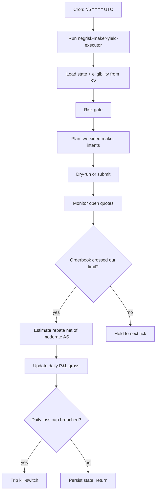

# NegRisk Maker Yield Executor

Consumes the eligibility list produced by the maker-yield scanner, plans two-sided maker limit-order intents per eligible constituent under risk caps, persists order intents (or submits them when explicitly armed), and accrues estimated rebate net of moderate-AS cost per cycle. The trade-capable layer of Pack 2; defaults to `dryRun: true` and a `notionalPerQuoteUsd: 50` first-live throttle.

## What it does

- Runs every 5 minutes at `*/5 * * * *` UTC to refresh maker quotes responsively as orderbook conditions evolve.
- Reads `makeryld:eligible_constituents` from KV; identifies constituents not already quoting.
- Applies risk caps: max-open-quotes, max-daily-notional, max-daily-loss with auto-tripping kill-switch.
- Computes per-constituent two-sided maker limit-price intents: BUY at `bestAsk − 5bp` and SELL at `bestBid + 5bp` (inside-spread, rebate-positive, never crosses).
- In dryRun, persists the quote intent as a reviewable proof and surfaces a cycle summary.
- In live mode (after operator arming), submits both buy and sell maker orders via `managePredictionOrders` (production submission lines are intentionally stubbed in the as-shipped workflow; going live requires uncommenting them).
- Monitors open quotes, settles when the orderbook crosses our limit (in dryRun this is the estimated fill check), estimates rebate net of moderate-AS cost.
- Aggregates realised P&L gross per day and trips the kill-switch on daily-loss-cap breach.

## Capability contract

- Trigger: cron `*/5 * * * *` in `UTC`.
- Inputs:
  - workflowId: `negrisk-maker-yield-executor`
  - signalKey: `makeryld:eligible_constituents`
  - notionalPerQuoteUsd: 50
  - maxOpenQuotes: 5
  - maxDailyNotionalUsd: 2000
  - maxDailyLossUsd: 50
  - makerLimitPriceOffsetBp: 5
  - makerRebateBp: 18.75
  - asScenarioFraction: 0.5
  - dryRun: true
- Outputs:
  - per-cycle intent + result at `/workspace/scratch/makeryld_cycle.json`
  - human-readable summary at `/workspace/scratch/makeryld_summary.md`
  - per-token quote state at `makeryld:quotes:<yes_token>` KV
  - rolling daily P&L gross at `makeryld:daily_pnl:<YYYY-MM-DD>` KV
  - daily notional opened at `makeryld:daily_notional:<YYYY-MM-DD>` KV
- Side effects:
  - reads sibling-recipe KV state (`makeryld:*`)
  - writes KV under `makeryld:*` namespace
  - in live mode: submits Polymarket maker orders on both sides per allowed constituent
- Failure modes:
  - empty eligibility KV (idle return)
  - risk-gate block (logged, no quotes placed)
  - orderbook call failure (constituent excluded from this cycle)
  - kill-switch tripped (no new quotes until operator resets)
- Strategy state transitions:
  - idle → evaluating on cron tick
  - evaluating → quoting when an eligible candidate passes risk gates
  - quoting → filled when orderbook crosses our limit
  - filled → settled after rebate-net-AS P&L recorded
  - any → killed when daily-loss cap breached

## Schedule diagram

## Setup

1. Install the workflow artifact at `workflows/negrisk-maker-yield-executor/references/negrisk-maker-yield-executor@latest.ts`.
2. Install the companion scanner recipe (`recipe-negrisk-maker-yield-scanner`) first. This executor consumes its KV state and idles if `makeryld:eligible_constituents` is empty.
3. Schedule this recipe at `*/5 * * * *` in `UTC`.
4. **Start with the defaults: `dryRun: true`, `notionalPerQuoteUsd: 50`. Verify dry-run cycle proofs at `/workspace/scratch/makeryld_cycle.json` and the executor summary over at least one observation window (≥ 7 days) before considering live promotion.**
5. To enable production submission (operator-arming step):
   - Edit the workflow TS at `workflows/negrisk-maker-yield-executor/references/negrisk-maker-yield-executor@latest.ts` and set `const dryRun = false` in both `plan_and_quote` and `monitor_and_settle` steps.
   - Uncomment the `managePredictionOrders` create blocks in `plan_and_quote`. The as-shipped artifact has these commented as a defense-in-depth so going live requires an explicit traceable edit.
   - Set `dryRun: false` in the recipe inputs for consistency (workflow-level constant is the actual gate).
   - Set `notionalPerQuoteUsd` to a small first-live value (e.g. $25).
   - Verify Polymarket account has USDC.e balance ≥ `maxDailyNotionalUsd`.
   - Monitor the first cycle end-to-end before relaxing.

## Quick Copy Prompt (Ask Gina)

~~~text
Create a scheduled workflow recipe:
- Name: NegRisk Maker Yield Executor
- Execute with agent: predictions
- Workflow: negrisk-maker-yield-executor@latest
- Schedule: */5 * * * *
- Timezone: UTC
- Task: Consume eligibility list from KV makeryld:eligible_constituents. For each eligible constituent not yet quoting, apply risk gate (max-open-quotes, max-daily-notional, max-daily-loss with auto kill-switch), refresh orderbook, compute two-sided maker limit-price intents at bestBid + 5bp (sell) and bestAsk - 5bp (buy), persist intents as dry-run proof. Monitor open quotes every tick, settle when current orderbook crosses our limit, estimate per-fill rebate (18.75 bp) net of moderate-AS cost. Aggregate realised P&L gross per day.
- Risk rules: notionalPerQuoteUsd 50, maxOpenQuotes 5, maxDailyNotionalUsd 2000, maxDailyLossUsd 50, makerLimitPriceOffsetBp 5, makerRebateBp 18.75, asScenarioFraction 0.5, dryRun true.

Then return:
- Ready-to-run workflow recipe config
- Today's cycle intents (or live order summaries)
- Open quotes with last-seen orderbook state
- Daily realised P&L gross and kill-switch state
~~~

## Security and permissions

- `security.permissions`: read-market-data, read-orderbook, read-position, place-prediction-trade, close-prediction-position, write-run-artifacts, write-local-state-file, write-agentfs-state.
- This is one of two recipes in the pack (alongside Pack 1's executor) with `place-prediction-trade` and `close-prediction-position`. The trade-capable code path exists; production submission lines are commented in the as-shipped workflow.
- Kill-switch auto-trips on daily-loss cap. Operator must explicitly reset `makeryld:kill_switch_state` to resume.
- Live promotion requires a sequence of explicit edits and reviews documented in Setup #5. Do not toggle `dryRun: false` without all of them.
- Do not persist Privy tokens, raw secret-bearing provider logs, or auth headers in artifacts.

## Evidence

- Source recipe: this file.
- Workflow source: `workflows/negrisk-maker-yield-executor/references/negrisk-maker-yield-executor@latest.ts`.
- Build-day economic model: [`PROFITABILITY_ANALYSIS_MAKER_YIELD.md`](../../PROFITABILITY_ANALYSIS_MAKER_YIELD.md) and [`strategy-polymarket-negrisk-maker-yield.md#expected-economics`](../../strategies/trading/strategy-polymarket-negrisk-maker-yield.md#expected-economics).
- Underlying methodology: [polymarket-edge](https://github.com/harrywinter06-code/polymarket-edge) `WORLD_CUP_MM.md` + `polymarket_mm_sim.py`.

## Backlinks

- [Workflow](../../workflows/negrisk-maker-yield-executor/README.md)
- [Strategy](../../strategies/trading/strategy-polymarket-negrisk-maker-yield.md)
- [Pack README](../../README.md)
- Category: `recipes/predictions/` (resolves to `docs/categories/recipes.md` when merged into `awesome-gina`)
