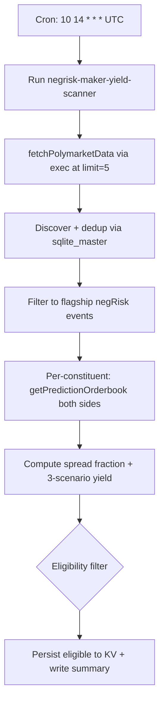

# NegRisk Maker Yield Scanner

Scheduled daily scan that applies the principled eligibility filter (mean_price ≥ 0.15 AND quote_half_spread_fraction ≤ 0.00375) to negRisk constituent markets and surfaces the structurally-positive-yield subset. Companion to the maker-yield executor recipe.

## What it does

- Runs the `negrisk-maker-yield-scanner` workflow once per day at 14:10 UTC.
- Self-bootstraps the Polymarket events table (no operator setup).
- Filters to negRisk events meeting the structural floor (sum_yes near 1.0 AND lifetime volume ≥ $1M).
- For each constituent, depth-walks both sides of the orderbook at $50 size and computes quoted half-spread, mid-price, and spread-fraction.
- Computes three-scenario maker yield per day (naive/moderate/informed AS) using maker rebate 18.75 bp and estimated daily captured notional from `volume_24h_usd × captureFraction`.
- Applies the eligibility filter; persists eligible constituents to `makeryld:eligible_constituents` KV.

## Capability contract

- Trigger: cron `10 14 * * *` in `UTC`.
- Inputs:
  - workflowId: `negrisk-maker-yield-scanner`
  - limit: 500
  - minMeanPrice: 0.15
  - maxSpreadFraction: 0.00375
  - minConstituents: 3
  - maxAbsDeviation: 0.10
  - minEventVolumeUsd: 1000000
  - makerRebateBp: 18.75
  - depthSizeUsd: 50
  - captureFraction: 0.05
  - maxConstituentsToWalk: 100
- Outputs:
  - eligible-constituent list with per-scenario yield + aggregate event basket totals
  - full per-constituent scoring including those filtered out
  - run artifacts at `/workspace/scratch/makeryld_scored.json`, `makeryld_eligible.json`, `makeryld_eligibility.md`
- Side effects:
  - reads Polymarket gamma + CLOB/orderbook data
  - writes KV state (`makeryld:*` namespace) and local run artifacts
  - does NOT submit orders, does NOT manage Struct watchers
- Failure modes:
  - no eligible constituents on a given run (expected most days, the structural filter intentionally rejects long-tail markets; WORLD_CUP_MM.md found 41 of 48 net-negative at moderate AS)
  - `getPredictionOrderbook` timeout on a constituent (excluded from this scan)
  - invalid orderbook state (skipped silently)

## Schedule diagram

## Setup

1. Install the workflow artifact from `workflows/negrisk-maker-yield-scanner/references/negrisk-maker-yield-scanner@latest.ts`.
2. Schedule the workflow at `10 14 * * *` in `UTC` (10 min after Pack 1 layers to avoid host-tool contention).
3. **No operator setup required.** Same self-bootstrap pattern as Pack 1's surfacer recipe.
4. Start with the documented defaults. The breakeven `maxSpreadFraction: 0.00375` is the analytic moderate-AS-breakeven from polymarket_mm_sim.py, relax only with explicit awareness of the AS-scenario implications.
5. Review `/workspace/scratch/makeryld_eligibility.md` after each run; per-event baskets show stacked per-scenario P&L.
6. The recipe is read/surface only. Promoting a flagged eligible constituent to a live maker quote is handled by the companion `recipe-negrisk-maker-yield-executor` recipe, which consumes `makeryld:eligible_constituents` from KV.

## Quick Copy Prompt (Ask Gina)

~~~text
Create a scheduled workflow recipe:
- Name: NegRisk Maker Yield Scanner
- Execute with agent: predictions
- Workflow: negrisk-maker-yield-scanner@latest
- Schedule: 10 14 * * *
- Timezone: UTC
- Task: Scan active Polymarket negRisk events, depth-walk every constituent of flagship-tier events on both sides, compute quoted bid-ask half-spread per constituent, score three-scenario maker yield (naive/moderate/informed AS), and surface only constituents passing the principled eligibility filter (mean_price >= 0.15 AND quote_half_spread_fraction <= 0.00375). Persist eligible-constituent list with per-scenario yield + aggregate event-basket totals to KV makeryld:eligible_constituents.
- Risk rules: limit 500, minMeanPrice 0.15, maxSpreadFraction 0.00375, minConstituents 3, maxAbsDeviation 0.10, minEventVolumeUsd 1000000, makerRebateBp 18.75, depthSizeUsd 50, captureFraction 0.05.

Then return:
- Ready-to-run workflow recipe config
- Today's eligible-constituent list with per-scenario yield
- Per-event basket totals (naive/moderate/informed)
- Filtered-out counts (by mean_price, by spread)
~~~

## Security and permissions

- `security.permissions`: read-market-data, read-orderbook, write-run-artifacts, write-local-state-file.
- Read/surface only, no trade execution, no Struct watcher mutation, no on-chain wallet activity.
- Safe to run on a daily schedule. The output is informational; no action automatically follows from a surfaced eligible constituent.
- Do not persist Privy tokens, raw secret-bearing provider logs, or auth headers in artifacts.

## Evidence

- Source recipe: this file.
- Workflow source: `workflows/negrisk-maker-yield-scanner/references/negrisk-maker-yield-scanner@latest.ts`.
- Underlying methodology: [polymarket-edge](https://github.com/harrywinter06-code/polymarket-edge) `WORLD_CUP_MM.md` (port baseline) + `src/polymarket_edge/polymarket_mm_sim.py` (analytic core: `estimate_half_spread`, `simulate_market_maker`, `breakeven_half_spread_fraction`).

## Backlinks

- [Workflow](../../workflows/negrisk-maker-yield-scanner/README.md)
- [Strategy](../../strategies/predictions/strategy-polymarket-negrisk-maker-yield.md)
- [Pack README](../../README.md)
- Category: `recipes/predictions/` (resolves to `docs/categories/recipes.md` when merged into `awesome-gina`)
