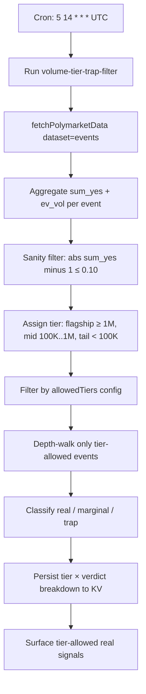

# Volume-Tier Trap Filter

Implements the count-vs-dollar reframe from the underlying polymarket-edge research as a runnable Gina automation. The 500-event scan in the source repo found 63.2% trap rate by count but only 0.012% by dollar-weighted lifetime volume because the World Cup `real` event carried 95.9% of flagged volume. This recipe applies that finding by classifying every flagged negRisk event into a dollar-volume tier (`flagship` ≥ $1M, `mid` $100K–$1M, `tail` < $100K) and surfacing only tier-allowed real signals.

## What it does

- Runs the `volume-tier-trap-filter` workflow once per day at 14:05 UTC (5 minutes after the NegRisk Event Arbitrage Surfacer recipe to avoid host overlap).
- Fetches active Polymarket events and aggregates `sum_yes` plus `event_lifetime_volume_usd` per event.
- Applies the same `|sum_yes - 1.0| ≤ 0.10` sanity filter as the surfacer recipe to exclude non-negRisk multi-option structures.
- Assigns every flagged event to a tier and persists the full `tier × verdict` cross-tabulation to KV for cross-day comparison.
- Depth-walks only tier-allowed events to keep scan cost proportional to deployable opportunity.
- Surfaces only tier-allowed real signals to the thread.

## Capability contract

- Trigger: cron `5 14 * * *` in `UTC`.
- Inputs:
  - workflowId: `volume-tier-trap-filter`
  - limit: 100
  - feeBufferBp: 50
  - minConstituents: 3
  - maxAbsDeviation: 0.10
  - flagshipFloorUsd: 1000000
  - midFloorUsd: 100000
  - allowFlagship: true
  - allowMid: false
  - allowTail: false
  - depth sizes 50/500/5000
- Outputs:
  - `voltier:latest_breakdown` — full tier × verdict cross-tabulation including `allowedTiersDollarShare`
  - `voltier:latest_surfaced` — tier-allowed real signals
  - run artifacts at `/workspace/scratch/voltier_filtered.json`, `voltier_classified.json`, `voltier_summary.md`
- Side effects:
  - reads Polymarket gamma + CLOB/orderbook data
  - writes KV state (`voltier:*` namespace) and local run artifacts
  - does NOT submit orders, does NOT manage Struct watchers
- Failure modes:
  - no flagship-tier events flag on a given run (expected most days; the dollar-tier reframe predicts exactly this concentration pattern)
  - depth-walk timeout on a constituent (event excluded from this run)
  - tier classification edge case where ev_vol crosses tier boundary mid-run (re-classified on next run)
- Strategy state transitions:
  - idle -> fetch on cron tick
  - fetch -> aggregate after table registered
  - aggregate -> tiered after volume-tier classification
  - tiered -> filtered after allowed-tier filter
  - filtered -> classified after depth-walk
  - classified -> surfaced once tier-allowed real signals are written

## Schedule diagram

## Setup

1. Install the workflow artifact from `workflows/volume-tier-trap-filter/references/volume-tier-trap-filter@latest.ts`.
2. Schedule at `5 14 * * *` in `UTC`.
3. **No operator setup required.** Same self-bootstrapping pattern as the surfacer recipe.
4. Start with `allowFlagship: true, allowMid: false, allowTail: false` (most aggressive trap-rate reduction, matches the empirical 0.012% by dollar finding).
5. To widen coverage to the `mid` tier ($100K–$1M event volume), set `allowMid: true`. Expect trap rate to grow toward the count-based number.
6. Review `voltier:latest_breakdown` over multiple runs; `allowedTiersDollarShare` should hover near 1.0 in steady state, validating that high-volume real signals dominate flagged dollar volume.

## Quick Copy Prompt (Ask Gina)

~~~text
Create a scheduled workflow recipe:
- Name: Volume-Tier Trap Filter
- Execute with agent: predictions
- Workflow: volume-tier-trap-filter@latest
- Schedule: 5 14 * * *
- Timezone: UTC
- Task: Scan active Polymarket negRisk events, apply 0.10 sanity band, classify each flagged event by lifetime dollar volume tier (flagship ≥ $1M, mid $100K-$1M, tail < $100K), depth-walk only tier-allowed events at $50/$500/$5000, and surface only tier-allowed real signals. Persist full tier × verdict breakdown to KV voltier:latest_breakdown for cross-day comparison.
- Risk rules: limit 100, feeBufferBp 50, minConstituents 3, maxAbsDeviation 0.10, flagshipFloorUsd 1000000, midFloorUsd 100000, allowFlagship true, allowMid false, allowTail false.

Then return:
- Ready-to-run workflow recipe config
- Today's tier × verdict cross-tabulation
- Today's tier-allowed real signals
- Allowed-tier dollar share for trend monitoring
~~~

## Security and permissions

- `security.permissions`: read-market-data, read-orderbook, write-run-artifacts, write-local-state-file.
- Read/surface only — no trade execution.
- Safe to run on a daily schedule.
- Do not persist Privy tokens, raw secret-bearing provider logs, or auth headers in artifacts.

## Evidence

- Source recipe: this file.
- Workflow source: `workflows/volume-tier-trap-filter/references/volume-tier-trap-filter@latest.ts`.
- Underlying empirical finding: [polymarket-edge](https://github.com/harrywinter06-code/polymarket-edge) `MICROSTRUCTURE.md` "Volume-weighted re-analysis" section and `scripts/volume_weighted_trap_rate.py`. 500-event scan, 19/500 flagged. Count-based trap rate 63.2%, dollar-weighted trap rate 0.012%, World Cup `real` event carried 95.9% of $1.15B flagged dollar volume.

## Backlinks

- [Workflow](../../workflows/volume-tier-trap-filter/README.md)
- [Strategy](../../strategies/predictions/strategy-polymarket-negrisk-basket-arbitrage.md)
- [Pack README](../../README.md)
- Category: `recipes/predictions/` (resolves to `docs/categories/recipes.md` when merged into `awesome-gina`)
