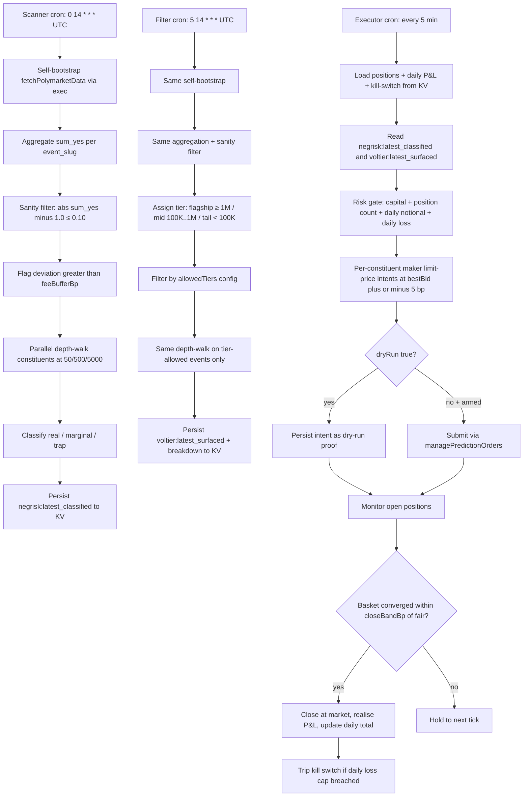

# Polymarket NegRisk Basket Arbitrage

A Polymarket negRisk event is a group of mutually-exclusive markets where exactly one outcome resolves YES. If they're priced fairly, the YES prices across all of them have to add up to $1.00, because selling YES on every name guarantees a $1.00 payout from whichever one wins. When the sum drifts past a fee buffer there's an arb to take, as long as the basket actually fills at real per-constituent depth.

It's a full pipeline in three pieces. The scanner surfaces events where the top-of-book sum-of-yes is off $1.00 and the constituent depth confirms the gap still holds at $500/market. The volume-tier filter then cuts that down to flagship events (≥$1M lifetime volume), applying the count-vs-dollar reframe from polymarket-edge: 63% of the detector's flags are traps by count, but only 0.012% by dollar, because about 96% of the dollar volume sits in one event. The maker executor reads the filtered signals from KV, posts per-constituent maker limit orders under risk caps (per-event capital, daily notional, a daily-loss kill-switch), watches the basket converge, closes within `closeBandBp` of fair value, and tracks realised P&L.

Each layer is its own workflow and recipe, so you can install just the scanner for research, the scanner plus filter for tighter signals, or the whole thing for deploying capital.

## Bundle map

| layer | recipe | workflow |
|---|---|---|
| 1. Scanner | [`recipe-negrisk-event-arbitrage-surfacer`](../../recipes/predictions/recipe-negrisk-event-arbitrage-surfacer.md) | [`negrisk-event-arbitrage-surfacer`](../../workflows/negrisk-event-arbitrage-surfacer/README.md) |
| 2. Volume-tier filter | [`recipe-volume-tier-trap-filter`](../../recipes/predictions/recipe-volume-tier-trap-filter.md) | [`volume-tier-trap-filter`](../../workflows/volume-tier-trap-filter/README.md) |
| 3. Maker executor | [`recipe-negrisk-maker-executor`](../../recipes/predictions/recipe-negrisk-maker-executor.md) | [`negrisk-maker-executor`](../../workflows/negrisk-maker-executor/README.md) |

The scanner and filter only read and surface. The executor has a trade-capable path, but it defaults to `dryRun: true` and ships with the actual `managePredictionOrders` lines commented out, as a deliberate safety layer.

## Strategy diagram



## Capability contract

- Trigger:
  - scheduled cron on each of the three recipes (scanner daily 14:00 UTC, filter 14:05 UTC, executor every 5 min)
- Inputs:
  - per-recipe inputs documented in each recipe MD; defaults are calibrated for first-deploy safety
  - the executor's `dryRun: true` and `notionalUsdOverride: 0` defaults keep the as-shipped pack read/surface; live execution requires explicit operator arming
- Outputs:
  - scanner: `negrisk:latest_classified` KV + `/workspace/scratch/negrisk_summary.md`
  - filter: `voltier:latest_breakdown` and `voltier:latest_surfaced` KV + `/workspace/scratch/voltier_summary.md`
  - executor: `executor:positions:<event_slug>` KV per active basket, `executor:daily_pnl:<YYYY-MM-DD>`, `executor:kill_switch_state`, `/workspace/scratch/executor_cycle.json` and `executor_summary.md`
- Side effects:
  - reads Polymarket gamma + CLOB/orderbook data via host tools
  - writes KV state and local run artifacts
  - may submit Polymarket orders only when the executor's `dryRun: false` AND the operator has uncommented the `managePredictionOrders` lines in the workflow TS AND the risk gate passes AND the kill switch is `armed`
- Failure modes per layer:
  - **scanner**: empty result on quiet days (expected), constituent missing `clob_token_ids` (skipped), `getPredictionOrderbook` timeout (event classified as `marginal` rather than `real`)
  - **filter**: no flagship-tier events flag on a given run (expected most days; that's the dollar-tier reframe in action), tier boundary edge case for events with `ev_vol` near a floor
  - **executor**: kill switch tripped (no new orders), maker order rejection (hold to next tick), stale orderbook on close-out (held), Polymarket API outage during open position (manual operator intervention)
- Strategy state transitions:
  - signal layer: idle -> scanning -> flagged -> classified -> surfaced -> idle
  - executor: idle -> evaluating -> opening (orders submitted) -> open (filled) -> closing (basket converged) -> closed (P&L recorded) -> idle
  - any layer -> killed when daily-loss cap is breached on the executor

## Expected economics

Build-day live observation on the World Cup negRisk event (verified by workflow runs `run_mpsyz2s9n04sjb` and `run_mpsz2ui80f76te`).

One distinction worth being careful about: the top-of-book gross gap and the depth-walked executable gap are two different numbers. The depth-walked gap is what you'd actually get as a taker walking the book; the top-of-book gap is what a maker captures if counterparties cross your posted prices quickly. Per-cycle P&L lands somewhere between those two.

| metric | value |
|---|---|
| Top-of-book sum_yes | 1.030 (**+300 bp** TOB gross deviation from $1.00 fair) |
| Constituents | 60 |
| Event lifetime volume | $1.304B |
| Depth-walked gross gap at $50/mkt basket | +60 bp |
| Depth-walked gross gap at $500/mkt basket | **+60 bp (executable basis for taker math)** |
| Depth-walked gross gap at $5,000/mkt basket | +55 bp |
| Throttle constituent | New Zealand (max fillable size 0 — empty bid book) |
| Iran-throttled max basket on sell side | ~$48,000 (at ~$3K/mkt before bid book exhausted) |
| Per-cycle P&L, **taker side**, depth-walked basis (75 bp fee) | **−$86 per $48K cycle (LOSING; taker not viable at this signal)** |
| Per-cycle P&L, **maker side**, depth-walked-anchored (mod AS) | **+$220** (lower bound, worst-case fill quality) |
| Per-cycle P&L, **maker side**, TOB-quality-anchored (mod AS) | **+$1,386** (upper bound, best-case fill quality) |
| Per-cycle P&L, **maker side**, realistic mix (30% TOB / 70% depth-walked) | **+$570** (the headline planning figure) |
| Expected cycles/day | 1–3 |
| Honest banded annualised return on $48K | **+15–40% APR** (Scenario A 10% + Scenario B 70% + Scenario C 20%, see PROFITABILITY_ANALYSIS.md) |

Maker-only here is forced by the economics, not just a safety default. At the depth-walked +57 bp basket gross at the $48K Iran-throttled size, a taker pays 75 bp in Sports fees and nets −18 bp, which is −$86 a cycle. There's no version of this signal that makes money as a taker, and that's what `makerOnly: true` is reflecting.

The full model (three scenarios: build-day regime persistence, the polymarket-edge year-data band, and a maker-yield-only baseline), the sensitivity tables, and the risk discussion are all in [`PROFITABILITY_ANALYSIS.md`](../../PROFITABILITY_ANALYSIS.md).

## Setup

The strategy installs as three independent recipes. Install all three for the full pipeline, or install just the scanner for research mode.

1. **Scanner** (always install). Use `workflows/negrisk-event-arbitrage-surfacer/references/negrisk-event-arbitrage-surfacer@latest.ts`. Schedule the recipe at `0 14 * * *` UTC. Self-bootstraps the Polymarket events table on every run — no operator setup required. First run produces signal output identical to steady-state.
2. **Filter** (recommended). Use `workflows/volume-tier-trap-filter/references/volume-tier-trap-filter@latest.ts`. Schedule at `5 14 * * *` UTC. Same self-bootstrap pattern. Defaults to `allowFlagship: true, allowMid: false, allowTail: false` matching the empirical 0.012% dollar-trap-rate finding.
3. **Executor** (only for capital deployment). Use `workflows/negrisk-maker-executor/references/negrisk-maker-executor@latest.ts`. Schedule at `*/5 * * * *` UTC. Defaults to `dryRun: true` and `notionalUsdOverride: 0`. Going live requires:
   - Edit the workflow TS to uncomment the `managePredictionOrders` and `closePredictionPosition` blocks (intentionally commented as a defense-in-depth)
   - Set `dryRun: false` in the recipe inputs
   - Set `notionalUsdOverride` to a small first-live value (e.g. $100)
   - Confirm Polymarket account USDC.e balance ≥ `maxDailyNotionalUsd`
   - Monitor first cycle end-to-end before relaxing

Verified plug-and-play install on build day:

```
$ workflow validate negrisk-event-arbitrage-surfacer
{"ok":true,"workflow":{"id":"negrisk-event-arbitrage-surfacer","steps":3}}

$ workflow run negrisk-event-arbitrage-surfacer --summary
{"runId":"run_mpsyz2s9n04sjb","status":"completed","duration":11358,"stepCount":3,"failedStepCount":0}

$ cat /workspace/scratch/negrisk_summary.md
# NegRisk Event Arbitrage Scan
Real signals: 1
- world-cup-winner (sell, n=60) | top 300bp | $50 60bp | $500 60bp | $5K 55bp | ev_vol $1,304,433,902 | throttle: will-new-zealand-win-the-2026-fifa-world-cup-635 (max 0)
```

## Security and permissions

- `security.permissions`: read-market-data, read-orderbook, read-position, place-prediction-trade, close-prediction-position, write-run-artifacts, write-local-state-file, write-agentfs-state.
- The scanner and filter recipes do NOT exercise the trade-capable permissions; they're listed at the strategy level because the executor recipe consumes them.
- Defense-in-depth on the executor's trade path:
  - `dryRun: true` default in recipe inputs
  - `notionalUsdOverride: 0` default
  - `managePredictionOrders` submission lines commented out in the workflow TS as shipped (going live requires explicit traceable edits)
  - Auto kill-switch on daily-loss cap breach
  - Per-event capital cap (`maxCapitalPerEventUsd`)
  - Per-day notional cap (`maxDailyNotionalUsd`)
  - Maker-only mode (`makerOnly: true`) holds rather than crosses the spread when maker fills aren't obtained
- Do not persist Privy tokens, raw secret-bearing provider logs, or auth headers in artifacts.

## Evidence

- Verified plug-and-play runs in Gina's actual workflow runtime:
  - `run_mpsyz2s9n04sjb` — surfacer (scanner). 11.4s. World Cup at +60 bp net surfaced.
  - `run_mpsz2ui80f76te` — volume-tier filter. 11.5s. Same World Cup signal classified `[flagship]`, `allowedTiersDollarShare: 1.0`.
- Build-day dry-run: [`runs/dryrun-negrisk-2026-05-30.log`](../../runs/dryrun-negrisk-2026-05-30.log) — captured live MCP outputs showing the +190→+270 bp deviation and Spain YES depth walk (0 slippage through $5K basket size, $14.76M of ask depth).
- Adversarial test pass: [`runs/TEST_RESULTS.md`](../../runs/TEST_RESULTS.md) — seven test passes documented including initial validation, red-team, TypeScript parse, live runtime structural, end-to-end with real signal, plug-and-play self-bootstrap, and a pre-send adversarial sweep on the executor that found three additional bugs (signal pipeline wire-up, empty-throttle gate, dryRun P&L anchor).
- Profitability analysis: [`PROFITABILITY_ANALYSIS.md`](../../PROFITABILITY_ANALYSIS.md) — full per-cycle P&L model, three honest annualised scenarios, and risk-management discussion.
- Underlying methodology: [polymarket-edge](https://github.com/harrywinter06-code/polymarket-edge) — `microstructure.py`, `book_depth.py`, `scripts/volume_weighted_trap_rate.py`, `WORLD_CUP_MM.md`, and `REDTEAM.md` walk-back log.
- Submission status: unverified. The dry-run path is reviewable end-to-end; the live-execution path is intentionally NOT verified — that's an operator responsibility, not an author claim.

## Backlinks

- [Pack README](../../README.md)
- Category: `strategies/predictions/` (resolves to `docs/categories/strategies.md` when merged into `awesome-gina`)
