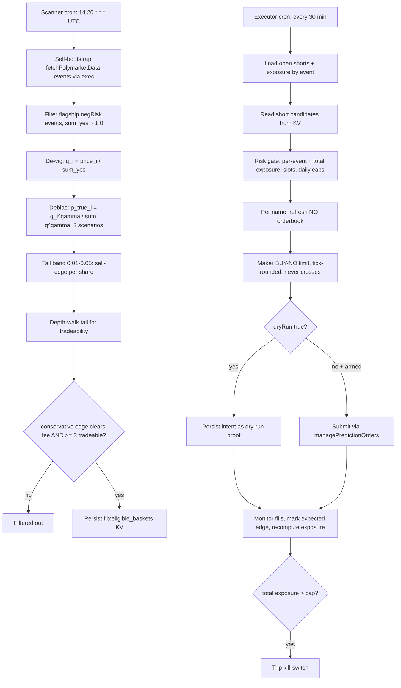

# Polymarket NegRisk Favourite-Longshot Bias Harvest

Pack 3 shorts the overpriced longshot tail of flagship negRisk baskets, going after the favourite-longshot
bias (FLB), which the prediction-market literature calls about the most replicated finding in the field.

It's the least flattering of the three packs, and that's deliberate. The headline isn't an APR, it's a
careful read of where the edge is and isn't. Read the [verdict](#honest-verdict-read-this-first) first.

## Honest verdict (read this first)

I built it, ran it live, and here's the honest summary: on this venue the longshot harvest is a thin,
capital-hungry, fat-tailed edge. Here's the build-day flagship basket (`world-cup-winner`, 48 priced
constituents, ~46 days to resolution):

| scenario | what it is | edge / shorted-notional | **return on collateral (period)** | **annualised** | tail-hit prob |
|---|---|---|---|---|---|
| **gamma = 1.0** | overround only — **the only venue-measurable number** | +1.9% | +0.03% | **~0.3%** | ~17% |
| gamma = 1.10 | central, **literature-anchored, NOT measured here** | +13.5% | +0.24% | **~1.9%** | ~15% |
| gamma = 1.20 | aggressive, literature-anchored | +24.4% | +0.44% | **~3.5%** | ~13% |

Three things to take from that table. First, ignore the "% of shorted notional" column — it flatters
the strategy. Shorting a longshot YES is really buying the NO token, which ties up close to full
collateral (~$1/share), so on the denominator that matters the edge is low single digits annualised
even in the aggressive case. Second, the only number you can actually measure on this venue is the
gamma=1 row, ~0.3% annualised, and that's just the overround, the maker spread, which every constituent
shares. It isn't a favourite-longshot edge at all. The real FLB part is the gamma>1 increment, and I
can't calibrate that here because the data layer never exposes historical resolutions. Third, the tail
is real and fat: the shorted names collectively win about 13-17% of the time, and when one does you pay
~$1 on a name you sold for a few cents. The basket caps it (only one name per event can resolve YES) but
doesn't remove it.

So my recommendation: run it only as a small, diversified satellite, and only if you separately believe
the literature gamma holds on Polymarket Sports and you're willing to wear the tail. At the floor you can
actually measure, it's just a maker-spread play that Pack 2 already does. The value here is the machinery
and the honest decomposition, not the APR.

### Verdict (measured backtest): SCOPE-DOWN / kill as a capital strategy — research / dry-run only

I checked the edge against the real settled-outcome tape: 3,319 constituents from 215 resolved negRisk
events (2024 election, NBA/NFL/UCL/PL champions, Fed), each priced 24h/72h/168h before resolution from
the CLOB `prices-history` endpoint and paired with how it actually resolved, run locally (full backtest:
[`runs/backtest/MEASURED_BACKTEST_FLB.md`](../../runs/backtest/MEASURED_BACKTEST_FLB.md)). It's a
calibration test, realized YES-frequency against price, not a "did my shorts win" replay that would
self-validate. So it returns losses when the bias isn't there, and it did.

The result: no statistically significant favourite-longshot edge at the 0.01–0.05 tail. Miscalibration
(price minus realized win-rate) is about ±1pp and the sign flips with the horizon (−0.43pp / +0.76pp /
−0.67pp at 24/72/168h), and every 90% bootstrap CI crosses zero (n = 195–543). The hand-set `gamma>1`
behind the 1.9%/3.5% ROC figures below isn't supported; measured, it's basically `gamma ≈ 1`, the
overround on its own. Two things did fall out of it. The extreme tail (<0.01) is biased the wrong way
(it resolves YES *more* than priced), which is exactly why the a-priori `longshotFloor = 0.01` was the
right call. And what mild FLB there is sits in the 0.10–0.50 band, outside this strategy's tail and just
as noisy.

There's no measured net that justifies putting money on this. Keep the scanner as a research surface and
the executor as a dry-run reference — the method is sound and the floor held up under measurement — but
don't allocate capital. The sim-derived `gamma>1` rows in the economics below are only the literature
prior now; the measured `gamma ≈ 1` supersedes them, so don't read them as deployable.

## The edge thesis

In a negRisk event the N mutually-exclusive YES prices sum to ~1.0 (that's Pack 1's invariant). What the
FLB literature says is that *within* that sum the prices get squeezed toward each other: favourites come
out underpriced and longshots overpriced relative to their true probability. The studies line up on the
direction:

- "A 70-cent contract actually corresponds to a true probability greater than 70%; the favourite is
  underpriced and the longshot is overpriced." (prediction-market calibration studies, 2024-2026)
- "Contracts with low prices resolved less often than expected, and contracts with high prices
  resolved more often than expected."
- The side that pays is the maker side: takers lose far more on cheap contracts than makers do, so the
  profitable move is *selling* the overpriced longshot (same thing as buying the underpriced NO).

This doesn't overlap with Pack 1. Pack 1 only fires when `sum_yes != 1`, a mechanical arb. FLB lives
inside a basket that already sums to ~1, where the mispricings cancel out in the sum, so the no-arb
scanner never sees it. It's a different thing from Pack 2 too: Pack 2 quotes the spread two-sided and
stays neutral, while this takes a directional bet on a behavioural mispricing right at the price extreme.

## The model (de-vig + power-transform debiasing)

1. **De-vig.** Renormalise each constituent to a risk-neutral implied probability: `q_i = price_i / sum(price)`.
2. **Debias (horse-racing power model).** The canonical FLB model for multi-outcome (pari-mutuel-like)
   markets: `p_true_i = q_i^gamma / sum_j(q_j^gamma)`, with `gamma >= 1`.
   - `gamma = 1` -> no behavioural bias; `p_true = q`; the only edge is the overround.
   - `gamma > 1` -> mass shifts toward favourites and away from longshots (classic FLB).
   This conserves probability (`sum p_true = 1` exactly) and is validated numerically on the live
   48-name `world-cup-winner` basket (see [TEST_RESULTS_FLB.md](../../runs/TEST_RESULTS_FLB.md)).
3. **Edge.** Per-share sell-YES edge = `price_i - p_true_i` (positive => overpriced => short). Reported
   at three gamma scenarios, exactly mirroring Packs 1/2's three-scenario discipline.

gamma is the assumption everything rests on, the same role adverse selection plays in Pack 2. Rather
than pick one value, I report all three scenarios and only gate eligibility on the gamma=1 row, the one
I can actually measure.

## Why the tail is bounded at 0.01-0.05

The scanner shorts only the constituent band `0.01 <= price <= 0.05`:

- Below 0.01: the literature is **mixed on the sign** (some studies find *reverse* FLB at the extreme
  tail) and a single resolution-source surprise dominates. We do not bet on a contested sign.
- Above 0.05: not a longshot; the FLB premium is small and the name is better handled as a Pack-2-style
  spread quote.

## Bundle map

| layer | recipe | workflow |
|---|---|---|
| 1. FLB-eligibility scanner | [`recipe-negrisk-flb-harvest-scanner`](../../recipes/predictions/recipe-negrisk-flb-harvest-scanner.md) | [`negrisk-flb-harvest-scanner`](../../workflows/negrisk-flb-harvest-scanner/README.md) |
| 2. FLB harvest executor | [`recipe-negrisk-flb-harvest-executor`](../../recipes/predictions/recipe-negrisk-flb-harvest-executor.md) | [`negrisk-flb-harvest-executor`](../../workflows/negrisk-flb-harvest-executor/README.md) |

Layer 1 only reads and surfaces. Layer 2 has the same defenses as the Pack 1/2 executors (`dryRun: true`
hardcoded, the submission lines commented out), plus a risk model built around diversification, because
these positions sit on the books until the event resolves.

## Risk model (why it differs from Packs 1 and 2)

FLB P&L only lands when the event resolves; you won't know if a World Cup longshot won until July. So
unlike Pack 2, which earns a rebate on every fill, this executor marks an expected edge when it fills and
then carries the resolution risk until settlement. That's why the main control here is exposure, not
realised daily P&L:

- **Per-event exposure cap** (`maxExposurePerEventUsd`, default $50): within one negRisk event the
  shorted names are mutually exclusive, so concentration there is a single correlated bet. Hard-capped.
  (Live-verified: 10 same-event candidates were correctly throttled to 2 at the $50 cap.)
- **Total exposure cap** (`maxTotalExposureUsd`, default $300): auto-trips the kill-switch on breach.
- **Diversification across uncorrelated events** is what makes the tail survivable; the strategy is
  designed to spread small shorts across many events, not to size up within one.
- Max open positions, daily notional cap, and a daily-loss kill-switch retained for parity with Packs 1/2.

## Strategy diagram

## Capability contract

- Trigger:
  - scanner: daily cron `14 20 * * *` UTC (offset from Packs 1/2 to avoid host-tool contention)
  - executor: cron `*/30 * * * *` UTC (slower than Pack 2 — positions are held to resolution, not requoted intraday)
- Inputs: per-recipe, documented in each recipe MD; defaults calibrated for first-deploy safety.
- Outputs:
  - scanner: `flb:eligible_baskets` KV (per-basket edge triple + per-name short list with NO token) + `/workspace/scratch/flb_eligibility.md`
  - executor: `flb:positions:<no_token>` per short, `flb:exposure_state`, `flb:daily_notional:<date>`, `flb:kill_switch_state`, `/workspace/scratch/flb_cycle.json` and `flb_summary.md`
- Side effects: reads Polymarket gamma + CLOB/orderbook; writes KV + artifacts; may submit Polymarket maker BUY-NO orders only when executor `dryRun: false` AND the operator has uncommented `managePredictionOrders` AND the risk gate passes AND the kill switch is armed.
- Failure modes per layer:
  - **scanner**: empty result on quiet days (expected — most events are not flagship or have no tradeable 0.01-0.05 tail), constituent missing `clob_token_ids` (skipped), `getPredictionOrderbook` timeout (constituent excluded), basket with `sum_yes` outside `1 +/- maxAbsDeviation` (excluded as non-negRisk).
  - **executor**: kill switch tripped (no new shorts), per-event/total exposure cap reached (logged, no shorts), invalid NO orderbook (name excluded), maker order rejection in live mode (held to next tick).

## Expected economics

See the [honest verdict table](#honest-verdict-read-this-first) above and the full model in
[`PROFITABILITY_ANALYSIS_FLB.md`](../../PROFITABILITY_ANALYSIS_FLB.md): three gamma scenarios,
return-on-collateral (not return-on-notional), per-event tail-loss leg led first, and the explicit
measured-vs-literature-anchored split.

## Setup

Two independent recipes. Install both for the full pipeline, or just the scanner for research mode.

1. **Scanner** (always install). Use `workflows/negrisk-flb-harvest-scanner/references/negrisk-flb-harvest-scanner@latest.ts`. Schedule at `14 20 * * *` UTC. Self-bootstraps the Polymarket events table — no operator setup.
2. **Executor** (only for capital deployment). Use `workflows/negrisk-flb-harvest-executor/references/negrisk-flb-harvest-executor@latest.ts`. Schedule at `*/30 * * * *` UTC. Defaults to `dryRun: true` and `collateralPerNameUsd: 25`. Going live requires:
   - Edit the workflow TS: set `const dryRun = false` in both `plan_and_short` and `monitor_and_mark`.
   - Uncomment the `managePredictionOrders` block in `plan_and_short` (commented as defense-in-depth).
   - Set `collateralPerNameUsd` to a small first-live value.
   - Confirm Polymarket account USDC.e balance >= `maxTotalExposureUsd`.
   - **Understand that positions are held to resolution.** Review dry-run proofs at `/workspace/scratch/flb_cycle.json` and confirm you accept the tail before arming.

## Differentiation from Packs 1 and 2

| dimension | Pack 1 (Basket Arb) | Pack 2 (Maker Yield) | Pack 3 (FLB Harvest) |
|---|---|---|---|
| Fires when | `sum_yes != 1` (mechanical arb) | always (continuous quoting) | `sum_yes ~ 1` but internal allocation biased |
| Edge source | no-arb gap | bid-ask spread + rebate | favourite-longshot behavioural bias |
| Posture | basket arb (maker-only) | two-sided neutral maker | directional tail short (BUY NO) |
| Risk profile | market-neutral | market-neutral | directional, fat-tailed, held to resolution |
| P&L timing | on convergence | per fill (rebate) | only at event resolution |
| Honesty headline | depth-walked vs TOB gap | knife-edge at moderate AS | measured tail edge ≈ 0 (not significant); thin ROC |

All three can run simultaneously on the same events — they target different mispricings across the
negRisk lifecycle.

## Security and permissions

- `security.permissions`: read-market-data, read-orderbook, read-position, place-prediction-trade, close-prediction-position, write-run-artifacts, write-local-state-file, write-agentfs-state.
- The scanner does NOT exercise trade-capable permissions; they are listed at strategy level because the executor consumes them.
- Defense-in-depth on the executor (mirrors Packs 1/2 + FLB-specific exposure caps):
  - `dryRun: true` hardcoded in both trade-touching steps
  - `managePredictionOrders` submission lines commented out in the as-shipped artifact
  - per-event exposure cap + total exposure cap with auto kill-switch
  - maker-only BUY-NO clamps (never crosses the ask)
  - NaN-guarded exposure aggregation (a non-numeric book cannot silently mask risk)
- Do not persist Privy tokens, raw secret-bearing provider logs, or auth headers in artifacts.

## Evidence

- Live plug-and-play runs in Gina's actual workflow runtime:
  - scanner pre-fix (found the table-discovery bug): `run_mpu8qsm5sckt6g`
  - scanner post-fix (real signal: 1 eligible basket, 10 short candidates): `run_mpu8uvavqxig7b`
  - executor (consumes signal, risk-gated, dry-run intents, per-event cap enforced): `run_mpu8xb3jhmvuoi`
- Adversarial test pass + numeric model validation: [`runs/TEST_RESULTS_FLB.md`](../../runs/TEST_RESULTS_FLB.md)
- Profitability analysis: [`PROFITABILITY_ANALYSIS_FLB.md`](../../PROFITABILITY_ANALYSIS_FLB.md)
- Underlying anomaly: favourite-longshot bias, the most-replicated finding in prediction-market and
  pari-mutuel-betting research (Thaler-Ziemba 1988 and the modern Polymarket/Kalshi calibration literature).
- Submission status: unverified. The dry-run path is reviewable end-to-end; the live-execution path is
  intentionally NOT verified — operator responsibility.

## Backlinks

- [Pack README](../../README.md)
- Category: `strategies/predictions/` (resolves to `docs/categories/strategies.md` when merged into `awesome-gina`)
