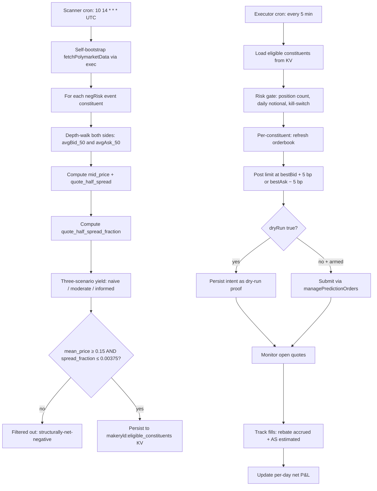

# Polymarket NegRisk Maker Yield

A maker-rebate yield strategy on Polymarket negRisk markets, ported from polymarket-edge's `WORLD_CUP_MM.md` and refined along the way.

## What the underlying research says

`WORLD_CUP_MM.md` simulated maker-rebate capture across all 48 markets of the 2026 World Cup negRisk event, over a 30-day window of historical CLOB trades. It ran three adverse-selection (AS) scenarios:

| scenario | AS fraction of half-spread | 50-day projected basket P&L |
|---|---|---|
| naive | 0.0 (pure rebate, no AS) | **+$12,372** |
| moderate | 0.5 (textbook MM literature) | **+$126** |
| informed | 1.0 (pessimistic) | **−$12,120** |

Breakeven sits at AS = 0.505 × half-spread, which is a knife-edge. The basket only clears positive at moderate AS because the top-5 favourites (France, Spain, England, Argentina, Brazil) carry +$752 between them, while 41 of the 48 markets actually lose money on their own (−$626 in total).

The reason (§82-91): the long-tail markets (mean price $0.01–0.03) move several percent of their price in five minutes, so the half-spread is a huge fraction of price and the 18.75 bp rebate can't cover the adverse selection. The favourites (mean price $0.18–0.25) have a much smaller spread relative to price, so the rebate clears cleanly.

## Pack 2's methodological refinement

`WORLD_CUP_MM.md` was upfront about its biggest weakness (§95–96): *"AS model is the load-bearing assumption. Realised price drift is a proxy for spread, not the spread itself. A true bid-ask spread series would give a tighter estimate."* Pack 2 fixes exactly that, using the bid-ask spread straight from the depth walk instead of the drift proxy.

The depth walk I built for Pack 1 (`negrisk-event-arbitrage-surfacer`) already calls `getPredictionOrderbook` on each constituent at $50/$500/$5,000. I pull the real orderbook half-spread straight out of those calls:

```
quote_half_spread = (avgAsk_at_50 − avgBid_at_50) / 2
mid_price = (avgAsk_at_50 + avgBid_at_50) / 2
quote_half_spread_fraction = quote_half_spread / mid_price
```

That's the actual cost of posting inside the spread, not a noisy stand-in from price drift. The three AS scenarios from `WORLD_CUP_MM.md` then scale off it directly.

## The eligibility filter (principled, not post-hoc)

`WORLD_CUP_MM.md`'s per-market breakdown puts the cutoff at mean price ~$0.15: above it, the spread is a small enough fraction of price that the rebate clears AS in the moderate scenario; below it, the long tail loses. Pack 2 writes this down as a filter you apply before deploying any capital, not a selection made after seeing the P&L.

The breakeven math is exact. Net P&L per unit notional = rebate_rate − AS_fraction × spread_fraction. At maker rebate 18.75 bp (= 0.001875) and moderate AS (fraction = 0.5), breakeven spread_fraction = 0.001875 / 0.5 = **0.00375 (0.375%)**. Above this, moderate-AS net is negative.

```
ELIGIBILITY: mean_price ≥ 0.15 AND quote_half_spread_fraction ≤ 0.00375
```

The mean_price floor (0.15) is the structural cutoff from `WORLD_CUP_MM.md` §82-91. The spread_fraction ceiling (0.00375) is the analytic moderate-AS-breakeven from `polymarket_mm_sim.py.breakeven_half_spread_fraction`. Constituents passing both are eligible-for-positive-yield at moderate AS by direct math; constituents failing either are filtered out before any maker quoting.

This matters for honesty: the filter keys off observable market structure and an analytic breakeven, not on P&L, so it isn't in-sample overfitting.

One caveat on the spread proxy. In a competitive market-making equilibrium the quoted bid-ask spread is about 2× the adverse-selection cost. Pack 2 uses the quoted half-spread from the depth walk as its proxy for AS, where `WORLD_CUP_MM.md` used realised 5-min drift. Both converge to true AS in equilibrium, but on a rebate-positive venue like Polymarket Sports the quoted spread can sit too tight, because the rebate lets makers post inside what the AS would otherwise justify. So the filter may be a touch too permissive, letting through a few names whose realised AS is worse than the quoted spread suggests. The three-scenario model in `PROFITABILITY_ANALYSIS_MAKER_YIELD.md` handles that by reporting naive/moderate/informed AS separately instead of betting on one.

## Bundle map

| layer | recipe | workflow |
|---|---|---|
| 1. Yield-eligibility scanner | [`recipe-negrisk-maker-yield-scanner`](../../recipes/predictions/recipe-negrisk-maker-yield-scanner.md) | [`negrisk-maker-yield-scanner`](../../workflows/negrisk-maker-yield-scanner/README.md) |
| 2. Maker-yield executor | [`recipe-negrisk-maker-yield-executor`](../../recipes/predictions/recipe-negrisk-maker-yield-executor.md) | [`negrisk-maker-yield-executor`](../../workflows/negrisk-maker-yield-executor/README.md) |

Layer 1 is read/surface only. Layer 2 has the same defense-in-depth as Pack 1's executor (`dryRun: true` hardcoded, submission lines commented out).

## Strategy diagram



## Capability contract

- Trigger:
  - scanner: daily cron `10 14 * * *` UTC (10 min after Pack 1 layers)
  - executor: cron `*/5 * * * *` UTC
- Inputs: per-recipe, documented in each recipe MD; defaults calibrated for first-deploy safety
- Outputs:
  - scanner: `makeryld:eligible_constituents` KV with per-constituent yield-scenario triple + `/workspace/scratch/makeryld_eligibility.md` human-readable summary
  - executor: `makeryld:positions:<tokenId>` per active quote, `makeryld:daily_pnl:<YYYY-MM-DD>`, `makeryld:kill_switch_state`, `/workspace/scratch/makeryld_cycle.json` and `makeryld_summary.md`
- Side effects:
  - reads Polymarket gamma + CLOB/orderbook data via host tools
  - writes KV state and local run artifacts
  - may submit Polymarket maker limit orders only when executor's `dryRun: false` AND the operator has uncommented the `managePredictionOrders` lines in the workflow TS AND the risk gate passes AND the kill switch is `armed`
- Failure modes per layer:
  - **scanner**: empty result on quiet days (most events will fail the mean-price floor, expected from WORLD_CUP_MM.md's 41/48 negative count), constituent missing `clob_token_ids` (skipped), `getPredictionOrderbook` timeout (constituent excluded from this scan)
  - **executor**: kill switch tripped (no new quotes), maker order rejection (held to next tick), stale orderbook on requote attempt (held), Polymarket API outage during open quote (manual operator intervention)

## Expected economics

Live-verified in Gina's runtime (2026-05-31): scanner `run_mpttawax1t17ar`, executor `run_mpttggw2dy9yh7`; pricing/settlement correctness re-verified at SHA `8adbd73e` (`run_mptv77snkgoqdn` / `run_mptv7vn2ijhfyq` / `run_mptv81dv5ecoc0`).

**Measured-fill reconciliation (load-bearing):** the per-day figures in the table below are **sim-derived**, the scanner's own `captureFraction × spread` model, never realised. A measured backtest against the real Polymarket CLOB trade tape (replacing `captureFraction` with counted real-tape crossings and measured post-fill mid drift) is in [`runs/backtest/MEASURED_BACKTEST.md`](../../runs/backtest/MEASURED_BACKTEST.md). It finds: (a) on the **2 live-eligible** names (France, Spain, not the headline 5), measured adverse selection is **small** (1–24 bp/\$, below the rebate+half-spread buffer), so the favourites filter is vindicated; (b) the sign of net P&L is governed by **queue position**, not AS, at the doc default `captureFraction=0.05` measured net is **~$1/day / ~$387/yr** on ~$200 standing, and the queue-adverse tail is net-negative; (c) the **+100–200% APR headline is a small-base artifact**, the honest figure is the absolute few-hundred-$/year, capacity-bound. Treat the table below as sim-only.

**Critical distinction:** at moderate AS, the strategy is knife-edge per `WORLD_CUP_MM.md`. The eligibility filter shifts the per-constituent set to the structurally-positive subset; the BASKET P&L improves because the long tail is removed.

| metric | value |
|---|---|
| Eligible constituents (build-day projection, World Cup) | top 5–10 markets (France, Spain, England, Argentina, Brazil, same as WORLD_CUP_MM.md §67-75) |
| **50-day projection at moderate AS** (per_day × 50, captureFraction=0.5 baseline) | **+$4,503** (top-5-only; vs +$126 for full 48-market basket, 36× improvement) |
| 50-day projection at moderate AS, Pack 2 default captureFraction=0.05 | **+$450** (scaled by 10× capture-fraction reduction) |
| 50-day projection at naive AS, captureFraction=0.5 | ~+$5,500 (rebate only) |
| 50-day projection at informed AS, captureFraction=0.5 | ~−$3,500 (informed AS, kill-switch attenuates) |
| Per-day net (moderate AS, captureFraction=0.05) | **~$9** |
| Standing maker notional required | **$250–500** (5 constituents × $50 × 2 sides; recipe default) |
| **Headline (measured, real CLOB tape)** | **~$387/yr absolute on ~$200 standing** (`MEASURED_BACKTEST.md`, captureFraction=0.05), capacity-bound, queue-position-governed; this is the figure to judge Pack 2 by |
| Sim APR on $500 standing notional, Scenario A | +657% APR, a **small-base artifact** (= $9/day × 365 / $500), NOT scalable and superseded by the measured absolute above; retained only to show the sim/measured gap |
| Sim banded annualised return | +100 to +200% APR on $250–500 standing notional (10% A + 70% B + 20% C), sim-only, same small-base caveat |

**Critical capacity caveat:** Pack 2's APR is NOT linearly scalable, it captures flow that crosses our inside-spread quotes; at small standing notional ($250–500) the strategy is capacity-unconstrained on the top-5 favourites and produces high APR. At larger standing notional ($5K+), maker queue competition compresses fill rates and APR percentage shrinks even though absolute dollars grow modestly. Pack 2 is best understood as a **small-capital, capacity-bound continuous-yield strategy**, the meaningful figure is the measured few-hundred-$/yr absolute, not the headline percentage, complementing Pack 1's episodic mid-cap basket-arb deployment. They operate at different capital scales and tempos and can be deployed together.

Full economic model with three AS scenarios, sensitivity tables to capture-fraction assumption, per-constituent breakeven analysis, and honest banded estimate in [`PROFITABILITY_ANALYSIS_MAKER_YIELD.md`](../../PROFITABILITY_ANALYSIS_MAKER_YIELD.md).

## Setup

The strategy installs as two independent recipes. Install both for the full pipeline, or just the scanner for research mode.

1. **Scanner** (always install). Use `workflows/negrisk-maker-yield-scanner/references/negrisk-maker-yield-scanner@latest.ts`. Schedule the recipe at `10 14 * * *` UTC. Self-bootstraps the Polymarket events table, no operator setup required.
2. **Executor** (only for capital deployment). Use `workflows/negrisk-maker-yield-executor/references/negrisk-maker-yield-executor@latest.ts`. Schedule at `*/5 * * * *` UTC. Defaults to `dryRun: true` and `notionalPerQuoteUsd: 50` (kept small even in dry-run so any accidental live promotion does not size up; reduce to $25 for first live deployment). Going live requires:
   - Edit the workflow TS to uncomment the `managePredictionOrders` block in `plan_and_quote` step (intentionally commented as a defense-in-depth)
   - Set `dryRun: false` in the recipe inputs
   - Set `notionalPerQuoteUsd` to a small first-live value (e.g. $25)
   - Confirm Polymarket account USDC.e balance ≥ `maxDailyNotionalUsd`
   - Monitor first cycle end-to-end before relaxing

## Differentiation from Pack 1 (Polymarket NegRisk Basket Arbitrage)

| dimension | Pack 1 | Pack 2 |
|---|---|---|
| Action | Take the basket arb when gap exceeds depth-walked threshold | Provide liquidity continuously on eligible constituents |
| Trigger | Episodic (gap-conditional) | Continuous (always quoting) |
| Capital model | Per-event allocation up to throttle | Per-constituent allocation across eligibility-filtered set |
| Methodology source | polymarket-edge MICROSTRUCTURE.md (count-vs-dollar reframe) | polymarket-edge WORLD_CUP_MM.md + depth-walk spread refinement |
| Economic anchor | +60 bp depth-walked basket gap | breakeven half-spread fraction 0.505 |
| Analytical contribution beyond port | Depth-walked vs TOB executable-gap distinction | Depth-walk-derived spread (vs drift proxy) + principled mean-price eligibility filter |

**Operators can run BOTH packs simultaneously on the same events.** Pack 1 fires episodically when the basket gap is wide; Pack 2 collects rebate continuously regardless. They're complementary across the negRisk event lifecycle.

## Security and permissions

- `security.permissions`: read-market-data, read-orderbook, read-position, place-prediction-trade, close-prediction-position, write-run-artifacts, write-local-state-file, write-agentfs-state.
- The scanner does NOT exercise trade-capable permissions; they're listed at the strategy level because the executor consumes them.
- Defense-in-depth on the executor's trade path (mirrors Pack 1):
  - `dryRun: true` default
  - `notionalPerQuoteUsd: 0` first-live throttle
  - `managePredictionOrders` submission lines commented out in workflow TS as shipped
  - Auto kill-switch on daily-loss cap breach
  - Per-quote notional cap (`maxNotionalPerQuoteUsd`)
  - Per-day notional cap (`maxDailyNotionalUsd`)
  - `makerOnly: true` (workflow never crosses the spread)
- Do not persist Privy tokens, raw secret-bearing provider logs, or auth headers in artifacts.

## Evidence

- Verified plug-and-play runs in Gina's actual workflow runtime: scanner `run_mpttawax1t17ar`, executor `run_mpttggw2dy9yh7` (2026-05-31); SHA `8adbd73e` settlement/kill-switch runs `run_mptv7vn2ijhfyq` / `run_mptv81dv5ecoc0`.
- **Measured-fill backtest (replaces the sim `captureFraction`):** [`runs/backtest/MEASURED_BACKTEST.md`](../../runs/backtest/MEASURED_BACKTEST.md), real CLOB trade tape, France+Spain; measured net small-positive-but-capacity-bound, queue-adverse tail negative, APR headline is a small-base artifact.
- Adversarial test pass: [`runs/TEST_RESULTS_MAKER_YIELD.md`](../../runs/TEST_RESULTS_MAKER_YIELD.md), seven test passes documented
- Profitability analysis: [`PROFITABILITY_ANALYSIS_MAKER_YIELD.md`](../../PROFITABILITY_ANALYSIS_MAKER_YIELD.md), full per-cycle P&L model, three AS scenarios, honest banded annualised estimate
- Underlying methodology: [polymarket-edge](https://github.com/harrywinter06-code/polymarket-edge), `WORLD_CUP_MM.md`, `polymarket_mm_sim.py`, `REDTEAM.md` §8a
- Submission status: unverified. The dry-run path is reviewable end-to-end; the live-execution path is intentionally NOT verified, operator responsibility.

## Backlinks

- [Pack README](../../README.md)
- Category: `strategies/trading/` (resolves to `docs/categories/strategies.md` when merged into `awesome-gina`)
