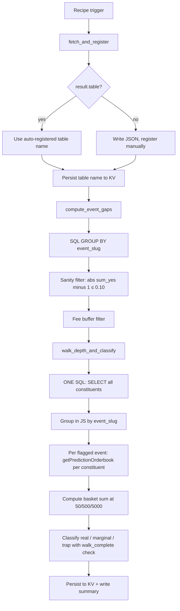

# NegRisk Event Arbitrage Surfacer Workflow

Workflow submission with artifact at `workflows/negrisk-event-arbitrage-surfacer/references/negrisk-event-arbitrage-surfacer@latest.ts`.

## What it does

- Fetches active Polymarket events via `fetchPolymarketData` with `dataset: "events"` and uses the auto-registered SQL table for downstream queries.
- Aggregates `sum_yes` per `event_slug` and applies a sanity filter (`|sum_yes - 1.0| ≤ 0.10`) to exclude multi-option non-exclusive event structures that would otherwise produce nonsensical "arbitrage" signals (e.g. WTI price-tier baskets summing to $13).
- Flags negRisk events whose top-of-book deviation from $1.00 exceeds the fee buffer (default 50 bp) and that have at least the minimum constituent count (default 3).
- For each flagged event, fetches the full constituent set in one SQL call (no per-event WHERE-clause concatenation; eliminates SQL injection vector) and groups in JS by `event_slug`.
- For each flagged event's constituents, calls `getPredictionOrderbook` with `slippageSizes: [50, 500, 5000]` and sums the per-size `avgFillPrice` across the basket to compute depth-aware gaps at three size tiers.
- Classifies each event as `real`, `marginal`, or `trap` based on whether the gap clears 50 bp at $500/constituent. Incomplete walks (some constituents failed orderbook lookup) are conservatively classified as `marginal` regardless of numerical gap.
- Persists the day's full classification to `negrisk:latest_classified` KV for downstream consumption by the executor recipe.

## Capability contract

- Trigger: recurring schedule `0 14 * * *` in `UTC`.
- Inputs:
  - `limit` (default 100)
  - `feeBufferBp` (default 50)
  - `minConstituents` (default 3)
  - `maxAbsDeviation` (default 0.10), sanity filter on `|sum_yes - 1.0|`
  - `minEventVolumeUsd` (default 0)
  - `depthSize1`/`2`/`3` (default 50/500/5000)
  - `maxEventsToWalk` (default 20)
  - `snapshotPrefix` (default `"negrisk:"`)
- Outputs:
  - `negrisk:latest_flagged` and timestamped `negrisk:<YYYY-MM-DDTHH>`, top-of-book flagged events (KV)
  - `negrisk:latest_classified`, real/marginal/trap classification (KV)
  - `/workspace/scratch/negrisk_flagged.json`, flagged event list (artifact)
  - `/workspace/scratch/negrisk_classified.json`, full classification (artifact)
  - `/workspace/scratch/negrisk_summary.md`, human-readable real-signals summary (artifact)
- Side effects:
  - reads Polymarket gamma + CLOB/orderbook data via host tools
  - writes KV under `negrisk:*` namespace and local run artifacts under `/workspace/scratch/`
  - does NOT submit orders, does NOT manage Struct watchers
- Failure modes:
  - no negRisk events flagged on a given run (expected on quiet days)
  - constituent missing `clob_token_ids` (skipped silently)
  - `getPredictionOrderbook` timeout on a constituent (event classified as `marginal` due to incomplete walk rather than `real`)
  - sum_yes deviation present but driven by a single illiquid constituent (caught by depth-walk classification as `trap`)

## Workflow steps

1. **fetch_and_register**, Call `fetchPolymarketData({ dataset: "events", active: true, limit })`. If response carries `result.table` (auto-registered case), use that table name directly. If response is an inline array (fallback for smaller datasets), write to `/workspace/scratch/polymarket_negrisk_raw.json` and register manually. Persist the resolved table name to `negrisk:current_table` KV for downstream steps.
2. **compute_event_gaps**, Read the table name from KV. Aggregate `sum_yes` and `ev_vol` per `event_slug` via SQL `GROUP BY` with `HAVING n >= minConstituents`. Apply the `|sum_yes - 1.0| ≤ maxAbsDeviation` JS-side sanity filter to exclude non-negRisk events. Flag events whose deviation exceeds the fee buffer. Persist flagged set to `negrisk:latest_flagged` KV and `negrisk_flagged.json` artifact.
3. **walk_depth_and_classify**, Read table name from KV. Fetch ALL constituents in one SQL call (eliminates SQL injection vector that per-event WHERE-clause would introduce), group in JS by `event_slug`. For each flagged event's constituents, call `getPredictionOrderbook` with `slippageSizes`. Compute basket sum at each size, classify, track walk-completeness. Conservative: incomplete walks → `marginal` regardless of gap. Persist final classification to `negrisk:latest_classified` KV and write summary.

## Execution diagram

## Setup

1. Use `workflows/negrisk-event-arbitrage-surfacer/references/negrisk-event-arbitrage-surfacer@latest.ts` as the source artifact.
2. Validate with `workflow validate negrisk-event-arbitrage-surfacer`.
3. Schedule the companion recipe at `0 14 * * *` UTC.
4. Ensure `kv.list` and `kv.get` parsing treat entries as `{key, value}` objects per the established polymarket-patterns reference.
5. Review `/workspace/scratch/negrisk_summary.md` after each run; full classification at `negrisk:latest_classified` KV.

## Security and permissions

- `security.permissions`: read-market-data, read-orderbook, write-run-artifacts, write-local-state-file, read/write-kv.
- Scope controls: allowlist host tools per step (`fetchPolymarketData` in step 1, `getPredictionOrderbook` in step 3); avoid wildcard permissions.
- Read/surface only, no trade execution, no Struct watcher mutation.
- Safe to run on a daily schedule.

## Evidence

- Source artifact: `workflows/negrisk-event-arbitrage-surfacer/references/negrisk-event-arbitrage-surfacer@latest.ts`.
- Companion strategy: `strategies/predictions/strategy-polymarket-negrisk-basket-arbitrage.md` (bundle strategy, Layer 1).
- Companion recipe: `recipes/predictions/recipe-negrisk-event-arbitrage-surfacer.md`.
- Build-day dry-run: `runs/dryrun-negrisk-2026-05-30.log`, captured live against the Gina MCP. World Cup event (60 constituents, sum_yes = 1.027 = +270 bp gross deviation, ev_vol $1.30B); representative constituent depth-walk (Spain YES, zero slippage through $5,000 basket size, $14.76M of ask depth).
- Adversarial test results: `runs/TEST_RESULTS.md`, documents two-pass red-team including SQL-injection-via-event-slug elimination, response-shape-handling fix, and walk-completeness conservative classification.
- Underlying methodology: [polymarket-edge](https://github.com/harrywinter06-code/polymarket-edge) `microstructure.py` + `book_depth.py`.

## Backlinks

- [Pack README](../../README.md)
- Category: `workflows/predictions/` (resolves to `docs/categories/workflows.md` when merged into `awesome-gina`)
