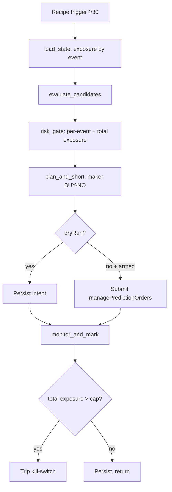

# NegRisk FLB Harvest Executor Workflow

Workflow submission with artifact at `workflows/negrisk-flb-harvest-executor/references/negrisk-flb-harvest-executor@latest.ts`.

## What it does

- Consumes `flb:eligible_baskets`; drops already-shorted names; re-checks the conservative-edge floor.
- Expresses each longshot short as a maker **BUY of the NO token**, the only collateralised way to
  short an overpriced longshot YES on Polymarket's CLOB. Collateral deployed ~ NO price ~ `1 - yes_price`.
- Diversification-first risk gate: **per-event exposure cap** (within-event names are mutually
  exclusive, so concentration is a single correlated bet), total exposure cap, max open positions,
  daily notional, daily-loss kill-switch.
- Refreshes the NO orderbook per allowed name; computes a maker BUY-NO limit (improve the bid by the
  offset, infer the tick from the live price grid, clamp so it never crosses the ask).
- Books **expected edge** on fill (mark-to-model EV at central gamma). **Realised P&L only materialises
  at event resolution**, so the primary control is exposure, not realised daily P&L.
- Recomputes total live exposure each cycle (NaN-guarded) and trips the kill-switch on breach.
- Defaults to `dryRun: true` hardcoded in both trade-touching steps; `managePredictionOrders` submission
  lines commented out as defense-in-depth.

## Capability contract

- Trigger: recurring schedule `*/30 * * * *` in `UTC` (positions are held to resolution, not requoted intraday).
- Inputs: `signalKey` (`flb:eligible_baskets`), `collateralPerNameUsd` (25), `maxOpenPositions` (8),
  `maxExposurePerEventUsd` (50), `maxTotalExposureUsd` (300), `maxDailyNotionalUsd` (200),
  `maxDailyLossUsd` (50), `makerLimitPriceOffsetBp` (5), `minSellEdgeConservative` (0.0), `dryRun` (true).
- Outputs:
  - `/workspace/scratch/flb_cycle.json` (per-cycle intents), `flb_summary.md`
  - `flb:positions:<no_token>` KV per short
  - `flb:exposure_state`, `flb:daily_notional:<date>`, `flb:kill_switch_state` KV
- Side effects: reads sibling-recipe KV (`flb:*`); writes KV (`flb:*`); in live mode submits Polymarket maker BUY-NO orders.
- Failure modes: empty eligibility KV (idle); risk-gate block (kill-switch, per-event/total exposure, daily caps); invalid NO orderbook (name excluded); kill-switch tripped (no new shorts until reset).

## Workflow steps

1. **load_state**, Sum exposure-at-risk across open shorts (grouped by event), daily notional, kill-switch.
2. **evaluate_candidates**, Read short list, drop already-open (by NO token), re-check conservative floor.
3. **risk_gate**, Per-event exposure cap (seeded from open exposure), total exposure cap, slots, daily caps, loss kill-switch.
4. **plan_and_short**, Refresh NO orderbook per allowed name; maker BUY-NO limit (tick-inferred, maker-only clamp); book expected edge; persist intent. `dryRun` hardcoded; submission commented.
5. **monitor_and_mark**, Re-check fills (NO bestAsk <= our limit); mark expected edge; recompute total exposure (NaN-guarded); trip kill-switch on breach.

## Execution diagram

## Setup

1. Use `workflows/negrisk-flb-harvest-executor/references/negrisk-flb-harvest-executor@latest.ts`.
2. Validate with `workflow validate negrisk-flb-harvest-executor`.
3. Install the companion scanner recipe first; this executor idles if `flb:eligible_baskets` is empty.
4. Schedule at `*/30 * * * *` UTC. **Start with `dryRun: true`, `collateralPerNameUsd: 25`.**
5. Live promotion (operator-arming): set `const dryRun = false` in `plan_and_short` and `monitor_and_mark`;
   uncomment the `managePredictionOrders` block; set a small `collateralPerNameUsd`; verify USDC.e balance
   >= `maxTotalExposureUsd`; understand positions are held to resolution and the tail is fat.

## Security and permissions

- `security.permissions`: read-market-data, read-orderbook, read-position, place-prediction-trade, close-prediction-position, write-run-artifacts, write-local-state-file, write-agentfs-state, read/write-kv.
- Trade-capable; production submission lines commented in the as-shipped artifact.
- Defense-in-depth: `dryRun: true` hardcoded x2; per-event + total exposure caps with auto kill-switch; maker-only BUY-NO clamps; NaN-guarded exposure aggregation; consume-time edge re-check.
- Adversarially tested (6 attacks, all blocked), see [`runs/TEST_RESULTS_FLB.md`](../../runs/TEST_RESULTS_FLB.md).

## Evidence

- Source artifact: `workflows/negrisk-flb-harvest-executor/references/negrisk-flb-harvest-executor@latest.ts`.
- Live run: `run_mpu8xb3jhmvuoi` (consumed 10 candidates; per-event cap correctly throttled to 2 dry-run shorts; expected edge $0.19 on $50). Full record in [`runs/TEST_RESULTS_FLB.md`](../../runs/TEST_RESULTS_FLB.md).
- Companion strategy: `strategies/trading/strategy-polymarket-negrisk-flb-harvest.md` (Layer 2).
- Companion recipe: `recipes/predictions/recipe-negrisk-flb-harvest-executor.md`.

## Backlinks

- [Pack README](../../README.md)
- Category: `workflows/trading/` (resolves to `docs/categories/workflows.md` when merged into `awesome-gina`)
