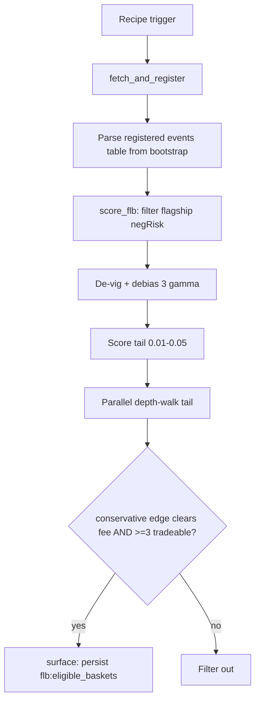

# NegRisk FLB Harvest Scanner Workflow

Workflow submission with artifact at `workflows/negrisk-flb-harvest-scanner/references/negrisk-flb-harvest-scanner@latest.ts`.

## What it does

- Self-bootstraps the Polymarket events table via `exec` to `host-tools fetchPolymarketData` at
  `limit=5`, then **parses the registered table name directly from the bootstrap output**
  (`{"table":"fetchPolymarketData_<hash>"}`) rather than guessing via `sqlite_master` ROWID ordering —
  which is unreliable across CREATE/DROP churn and was the cause of a real 0-result bug found in
  testing (run `run_mpu8qsm5sckt6g`).
- Filters to flagship negRisk events: `|sum_yes - 1.0| <= maxAbsDeviation` AND lifetime volume >= $1M
  AND >= `minConstituents` priced constituents.
- De-vigs each basket (`q_i = price_i / sum`) and debiases (`p_true_i = q_i^gamma / sum(q^gamma)`) at
  three scenarios (gamma 1.0 / 1.10 / 1.20). The power transform conserves probability exactly.
- Scores the longshot tail (`longshotFloor <= price <= longshotCeiling`, default 0.01-0.05): per-share
  sell edge, edge as % of shorted notional AND % of collateral deployed, collective tail win-prob.
- Parallel-depth-walks the tail (one `getPredictionOrderbook` per name) to confirm a live, non-degenerate
  book; degenerate books are excluded.
- Eligibility: the conservative (gamma=1, measurable overround) tail edge must clear the fee buffer AND
  >= `minTailConstituents` tradeable names. Behavioural upside (gamma>1) is reported, never gating.
- Persists eligible baskets + per-name short list (with NO token) to `flb:eligible_baskets` KV.

## Capability contract

- Trigger: recurring schedule `14 20 * * *` in `UTC`.
- Inputs: `limit` (500), `minConstituents` (4), `maxAbsDeviation` (0.10), `minEventVolumeUsd` (1e6),
  `longshotCeiling` (0.05), `longshotFloor` (0.01), `minTailConstituents` (3), `gammaConservative` (1.0),
  `gammaCentral` (1.10), `gammaAggressive` (1.20), `feeBufferBp` (50), `depthSizeUsd` (50),
  `maxConstituentsToWalk` (100).
- Outputs:
  - `flb:eligible_baskets` KV — consumed by `negrisk-flb-harvest-executor`
  - `flb:current_table` KV — bootstrapped table name for cross-step reuse
  - `/workspace/scratch/flb_scored.json`, `flb_eligible.json`, `flb_eligibility.md` artifacts
- Side effects: reads Polymarket gamma + CLOB/orderbook; writes KV (`flb:*`) and local artifacts; no order submission.
- Failure modes: no eligible baskets (expected most days); `getPredictionOrderbook` timeout (constituent excluded); basket outside the negRisk sanity band (excluded); empty/degenerate tail book (name not tradeable).

## Workflow steps

1. **fetch_and_register** — Self-bootstrap via `exec`; parse the registered events table from the
   bootstrap output (fallback: `sqlite_master`); alias + dedup by `market_id` to `polymarket_flb_raw`.
2. **score_flb** — Aggregate event-level `sum_yes` + `ev_vol`, filter flagship negRisk events. One SQL
   fetch of all constituents (extracts both YES and NO tokens). De-vig + debias 3 gamma scenarios.
   Score the 0.01-0.05 tail. Parallel-depth-walk for tradeability. Apply eligibility gate.
3. **surface** — Filter to eligible baskets, flatten to a per-name short list, persist to KV + summary.

## Execution diagram

## Setup

1. Use `workflows/negrisk-flb-harvest-scanner/references/negrisk-flb-harvest-scanner@latest.ts`.
2. Validate with `workflow validate negrisk-flb-harvest-scanner`.
3. Schedule the companion recipe at `14 20 * * *` UTC.
4. **No operator setup required.** Self-bootstrap pattern.
5. Review `/workspace/scratch/flb_eligibility.md`; the conservative column is the only measurable edge.

## Security and permissions

- `security.permissions`: read-market-data, read-orderbook, write-run-artifacts, write-local-state-file, read/write-kv.
- Scope controls: allowlist host tools per step (`fetchPolymarketData` in step 1, `getPredictionOrderbook` in step 2).
- Read/surface only — no trade execution. Safe on a daily schedule.

## Evidence

- Source artifact: `workflows/negrisk-flb-harvest-scanner/references/negrisk-flb-harvest-scanner@latest.ts`.
- Live runs: `run_mpu8qsm5sckt6g` (found the table-discovery bug), `run_mpu8uvavqxig7b` (post-fix, 1 eligible basket + 10 short candidates). Full record in [`runs/TEST_RESULTS_FLB.md`](../../runs/TEST_RESULTS_FLB.md).
- Companion strategy: `strategies/predictions/strategy-polymarket-negrisk-flb-harvest.md` (Layer 1).
- Companion recipe: `recipes/predictions/recipe-negrisk-flb-harvest-scanner.md`.

## Backlinks

- [Pack README](../../README.md)
- Category: `workflows/predictions/` (resolves to `docs/categories/workflows.md` when merged into `awesome-gina`)
