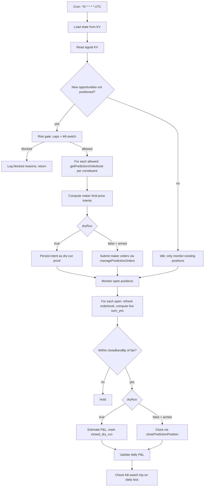

# NegRisk Maker Arbitrage Executor Workflow

Workflow submission with artifact at `workflows/negrisk-maker-executor/references/negrisk-maker-executor@latest.ts`.

## What it does

- Reads depth-verified real signals from sibling-recipe KV state (`negrisk:latest_classified` preferred; falls back to `voltier:latest_surfaced`).
- Applies a risk gate: per-event capital cap, max simultaneous open positions, max daily notional, max daily loss with auto-tripping kill-switch.
- Computes per-constituent maker limit-order intents at `bestBid + 5bp` (sell side) or `bestAsk - 5bp` (buy side) to be visible while staying rebate-positive.
- In `dryRun: true` mode (default), persists the order intent as a reviewable proof without submission.
- In `dryRun: false` mode (operator-armed), submits orders via `managePredictionOrders` and tracks fills (production submission is intentionally stubbed in the as-shipped workflow, see Setup #6).
- Monitors open positions every tick: re-queries each constituent's orderbook, computes the live basket `sum_yes`, closes positions when within `closeBandBp` (default 25 bp) of the $1.00 fair value.
- Aggregates realised P&L per day, persisted as `executor:daily_pnl:<YYYY-MM-DD>`.
- Auto-trips the kill-switch when daily-loss cap is breached; no further orders until manually reset.

## Capability contract

- Trigger: recurring schedule `*/5 * * * *` in `UTC` for responsive lifecycle tracking; opportunistic trigger when signal KV is updated also supported.
- Inputs:
  - `signalKeyArb` (default `"negrisk:latest_classified"`)
  - `signalKeyTier` (default `"voltier:latest_surfaced"`)
  - `maxCapitalPerEventUsd` (default 5000)
  - `maxOpenPositions` (default 3)
  - `maxDailyNotionalUsd` (default 20000)
  - `maxDailyLossUsd` (default 200)
  - `makerOnly` (default `true`)
  - `makerLimitPriceOffsetBp` (default 5)
  - `closeBandBp` (default 25)
  - `dryRun` (default `true`)
  - `notionalUsdOverride` (default 0), first-live notional throttle
- Outputs:
  - per-cycle intent + cycle-result JSON at `/workspace/scratch/executor_cycle.json`
  - human-readable summary at `/workspace/scratch/executor_summary.md`
  - per-event position state under `executor:positions:<event_slug>` KV
  - rolling daily P&L at `executor:daily_pnl:<YYYY-MM-DD>` KV
  - risk-gate decision log at `executor:risk_gate_result` KV
- Side effects:
  - reads Polymarket orderbook, position, and host-tool data
  - reads sibling-recipe KV state (`negrisk:*`, `voltier:*` namespaces)
  - writes KV under `executor:*` namespace and AgentFS state for position lifecycle
  - may submit Polymarket orders ONLY when `dryRun: false`, all risk gates pass, AND kill-switch is `armed`
  - may close Polymarket positions ONLY when `dryRun: false` and the open basket has converged to within `closeBandBp` of fair
- Failure modes:
  - no new signals in KV (idle return)
  - risk gate failure (logged, no orders placed)
  - maker order rejection by Polymarket (default: hold to next tick; if `makerOnly: false`, fall back to taker)
  - position fill timeout (configurable; default 4h hold then partial close)
  - kill-switch tripped (no new orders until operator resets `executor:kill_switch_state`)
  - stale orderbook on close-out attempt (held to next tick)

## Workflow steps

1. **load_state**, Read daily P&L, kill-switch state, and current open positions from KV; surface aggregate state for downstream steps.
2. **evaluate_signals**, Read `negrisk:latest_classified` and `voltier:latest_surfaced` from KV; identify real signals (`walk_complete === true` AND `gap_at_500_bp >= 50`) not already positioned.
3. **risk_gate**, Apply caps (kill-switch, daily-loss, max-open-positions, max-daily-notional, per-event-capital); produce `allowed` and `blocks` lists; auto-trip kill-switch on daily-loss-cap breach.
4. **plan_and_execute**, For each allowed opportunity, fetch fresh per-constituent orderbooks via `getPredictionOrderbook`, compute maker limit-price intents at `bestBid + offsetBp` (sell) or `bestAsk - offsetBp` (buy), persist intents to KV as dry-run proof OR (when `dryRun: false`) submit via `managePredictionOrders` (production path intentionally stubbed in the as-shipped artifact).
5. **monitor_and_close**, Iterate all open positions, refresh per-constituent orderbook midpoints, compute live basket `sum_yes`, close positions within `closeBandBp` of fair value (close path also stubbed for production; dry-run estimates P&L for review), aggregate realised P&L into `executor:daily_pnl:<date>`.

## Execution diagram

## Setup

1. Install workflow artifact at `workflows/negrisk-maker-executor/references/negrisk-maker-executor@latest.ts`.
2. Validate with `workflow validate negrisk-maker-executor`.
3. Install the companion surfacer + tier-filter recipes first. The executor consumes their KV state and will idle if `negrisk:latest_classified` is empty.
4. Schedule the executor recipe at `*/5 * * * *` in UTC for responsive position lifecycle.
5. **Start with `dryRun: true` and `notionalUsdOverride: 0`. Verify dry-run proofs at `/workspace/scratch/executor_cycle.json` over at least one observation window (≥ 7 days) before considering live promotion.**
6. To enable production submission (operator-arming step):
   - In the workflow TS, uncomment the `managePredictionOrders` / `closePredictionPosition` calls in `plan_and_execute` and `monitor_and_close` steps. These are intentionally stubbed in the as-shipped artifact as defense-in-depth, going live requires explicit, traceable edit.
   - Set `dryRun: false` in the recipe inputs.
   - Set `notionalUsdOverride` to a small first-live value (e.g. $100).
   - Confirm Polymarket account has USDC.e balance ≥ `maxDailyNotionalUsd`.
   - Monitor first cycle end-to-end before relaxing.

## Security and permissions

- `security.permissions`: read-market-data, read-orderbook, read-position, place-prediction-trade, close-prediction-position, write-run-artifacts, write-local-state-file, write-agentfs-state, read/write-kv.
- The workflow includes `place-prediction-trade` and `close-prediction-position` because the trade-capable code path exists. The as-shipped artifact has those submission lines commented out as defense-in-depth, even with `dryRun: false` they would not fire without explicit operator edit.
- Kill-switch (`executor:kill_switch_state`) auto-trips on daily-loss cap breach. Operator must explicitly reset to resume.
- Per-event basket notional cap and per-day notional cap provide defense-in-depth against runaway capital deployment.
- Maker-only mode (`makerOnly: true`) provides additional protection: if maker fills can't be obtained, the workflow holds rather than crossing the spread.
- Do not persist Privy tokens, raw secret-bearing provider logs, or auth headers in artifacts.

## Evidence

- Source artifact: `workflows/negrisk-maker-executor/references/negrisk-maker-executor@latest.ts`.
- Companion strategy: `strategies/trading/strategy-polymarket-negrisk-basket-arbitrage.md` (bundle strategy, Layer 3).
- Companion recipe: `recipes/predictions/recipe-negrisk-maker-executor.md`.
- Build-day live economic model: `PROFITABILITY_ANALYSIS.md` and `strategies/trading/strategy-polymarket-negrisk-basket-arbitrage.md#expected-economics`, derived from the World Cup observation in `runs/dryrun-negrisk-2026-05-30.log` (sum_yes 1.027, ev_vol $1.30B, Spain YES zero slippage through $5K basket) plus polymarket-edge `WORLD_CUP_MM.md` moderate-AS scenario.
- Pack-level profitability analysis: `PROFITABILITY_ANALYSIS.md`.

## Backlinks

- [Pack README](../../README.md)
- Category: `workflows/trading/` (resolves to `docs/categories/workflows.md` when merged into `awesome-gina`)
