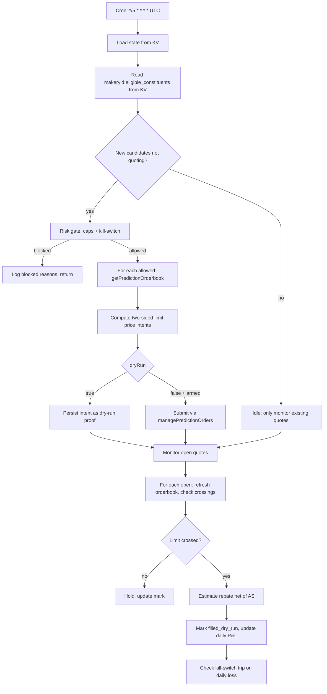

# NegRisk Maker Yield Executor Workflow

Workflow submission with artifact at `workflows/negrisk-maker-yield-executor/references/negrisk-maker-yield-executor@latest.ts`.

## What it does

- Reads eligible constituents from `makeryld:eligible_constituents` KV (produced by the scanner workflow).
- Applies a risk gate: max-open-quotes, max-daily-notional, max-daily-loss with auto-tripping kill-switch.
- For each allowed constituent, refreshes the orderbook and computes two-sided maker quote intents at `bestBid + 5bp` (sell side) and `bestAsk − 5bp` (buy side).
- In `dryRun: true` mode (default), persists the quote intent as a reviewable proof without submission.
- In `dryRun: false` mode (operator-armed), submits both buy and sell limit orders via `managePredictionOrders` (production submission lines are intentionally stubbed in the as-shipped workflow — see Setup #5).
- Monitors open quotes every tick: re-queries each constituent's orderbook, checks whether the current bestAsk/bestBid has crossed our limit, estimates rebate net of moderate-AS cost (capped at half-spread × scenario fraction).
- Aggregates realised P&L gross per day, persisted as `makeryld:daily_pnl:<YYYY-MM-DD>`.
- Auto-trips the kill-switch when the daily-loss cap is breached; no further quotes until manually reset.

## Capability contract

- Trigger: scheduled cron (recommended `*/5 * * * *` UTC for responsive quote refresh).
- Inputs:
  - `signalKey` (default `"makeryld:eligible_constituents"`)
  - `notionalPerQuoteUsd` (default 50)
  - `maxOpenQuotes` (default 5)
  - `maxDailyNotionalUsd` (default 2000)
  - `maxDailyLossUsd` (default 50)
  - `makerLimitPriceOffsetBp` (default 5)
  - `makerRebateBp` (default 18.75)
  - `asScenarioFraction` (default 0.5 — moderate-AS settlement)
  - `dryRun` (default `true`)
- Outputs:
  - per-cycle intent + cycle-result JSON at `/workspace/scratch/makeryld_cycle.json`
  - human-readable summary at `/workspace/scratch/makeryld_summary.md`
  - per-token quote state under `makeryld:quotes:<yes_token>` KV
  - rolling daily P&L gross at `makeryld:daily_pnl:<YYYY-MM-DD>` KV
  - daily notional tracking at `makeryld:daily_notional:<YYYY-MM-DD>` KV
  - risk-gate decision log at `makeryld:risk_gate_result` KV
- Side effects:
  - reads Polymarket orderbook + sibling-recipe KV state (`makeryld:eligible_constituents`)
  - writes KV under `makeryld:*` namespace and AgentFS state for quote lifecycle
  - may submit Polymarket maker limit orders ONLY when `dryRun: false`, all risk gates pass, AND kill-switch is `armed`
- Failure modes:
  - empty eligibility KV (idle return — scanner produced no eligible constituents)
  - risk gate failure (logged, no quotes placed)
  - orderbook call failure (constituent excluded from this cycle)
  - invalid orderbook state (bestBid ≤ 0 or crossed book — excluded)
  - kill-switch tripped (no new quotes until operator resets `makeryld:kill_switch_state`)

## Workflow steps

1. **load_state** — Read daily P&L gross, daily notional used, kill-switch state, and current open quotes from KV; surface aggregate state for downstream steps.
2. **evaluate_eligibility** — Read `makeryld:eligible_constituents` from KV; identify constituents not already quoting; persist candidates to `makeryld:last_candidates` KV + file for risk_gate consumption.
3. **risk_gate** — Apply caps (kill-switch, daily-loss, max-open-quotes, max-daily-notional); produce `allowed` and `blocks` lists; auto-trip kill-switch on daily-loss-cap breach.
4. **plan_and_quote** — For each allowed candidate, fetch fresh orderbook via `getPredictionOrderbook`, compute two-sided maker limit intents (`bestBid + 5bp` sell, `bestAsk − 5bp` buy), persist intents to KV as dry-run proof OR (when `dryRun: false`) submit via `managePredictionOrders` (production path intentionally stubbed).
5. **monitor_and_settle** — Iterate all open quotes, refresh per-constituent orderbook, check fills (orderbook crossed our limit), estimate per-cycle rebate net of AS, aggregate daily P&L gross into `makeryld:daily_pnl:<date>`.

## Execution diagram

## Setup

1. Install workflow artifact at `workflows/negrisk-maker-yield-executor/references/negrisk-maker-yield-executor@latest.ts`.
2. Validate with `workflow validate negrisk-maker-yield-executor`.
3. Install the scanner recipe first. The executor consumes its KV state and will idle if `makeryld:eligible_constituents` is empty.
4. Schedule the executor recipe at `*/5 * * * *` in UTC for responsive quote refresh.
5. **Start with `dryRun: true` and `notionalPerQuoteUsd: 50` (kept small even in dry-run so any accidental live path doesn't size up).** Verify dry-run intents at `/workspace/scratch/makeryld_cycle.json` over at least one observation window (≥ 7 days) before considering live promotion.
6. To enable production submission (operator-arming step):
   - In the workflow TS, set `const dryRun = false` in `plan_and_quote` and `monitor_and_settle` (currently hardcoded `true` as defense-in-depth).
   - Uncomment the `managePredictionOrders` create blocks in `plan_and_quote`. These are intentionally stubbed in the as-shipped artifact as defense-in-depth — going live requires explicit, traceable edits.
   - Set `dryRun: false` in the recipe inputs as well (for consistency, although the workflow-level constant is what actually controls execution).
   - Confirm Polymarket account has USDC.e balance ≥ `maxDailyNotionalUsd`.
   - Monitor first cycle end-to-end before relaxing notional caps.

## Security and permissions

- `security.permissions`: read-market-data, read-orderbook, read-position, place-prediction-trade, close-prediction-position, write-run-artifacts, write-local-state-file, write-agentfs-state, read/write-kv.
- The workflow includes `place-prediction-trade` and `close-prediction-position` because the trade-capable code path exists. The as-shipped artifact has those submission lines commented out as defense-in-depth — even with `dryRun: false` they would not fire without explicit operator edit.
- Kill-switch (`makeryld:kill_switch_state`) auto-trips on daily-loss cap breach. Operator must explicitly reset to resume.
- Per-quote notional cap (`notionalPerQuoteUsd`) and per-day notional cap (`maxDailyNotionalUsd`) provide defense-in-depth against runaway capital deployment.
- Maker-only by construction: the workflow never crosses the spread, only posts inside it via `makerLimitPriceOffsetBp`.
- Do not persist Privy tokens, raw secret-bearing provider logs, or auth headers in artifacts.

## Evidence

- Source artifact: `workflows/negrisk-maker-yield-executor/references/negrisk-maker-yield-executor@latest.ts`.
- Companion strategy: `strategies/predictions/strategy-polymarket-negrisk-maker-yield.md` (bundle strategy — Layer 2).
- Companion recipe: `recipes/predictions/recipe-negrisk-maker-yield-executor.md`.
- Underlying methodology: [polymarket-edge](https://github.com/harrywinter06-code/polymarket-edge) `WORLD_CUP_MM.md` + `polymarket_mm_sim.py` (analytic core).
- Pack-level profitability analysis: `PROFITABILITY_ANALYSIS_MAKER_YIELD.md`.

## Backlinks

- [Pack README](../../README.md)
- Category: `workflows/predictions/` (resolves to `docs/categories/workflows.md` when merged into `awesome-gina`)
