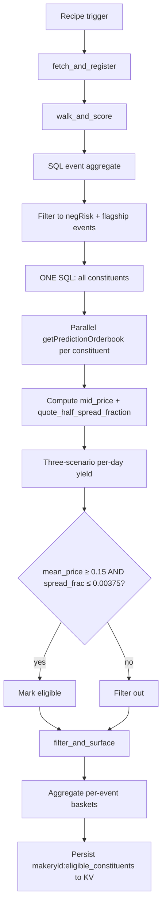

# NegRisk Maker Yield Scanner Workflow

Workflow submission with artifact at `workflows/negrisk-maker-yield-scanner/references/negrisk-maker-yield-scanner@latest.ts`.

## What it does

- Self-bootstraps the Polymarket events table via `exec` to `host-tools fetchPolymarketData` at `limit=5` (same pattern as Pack 1's surfacer).
- Filters to negRisk events at the structural floor: `|sum_yes − 1.0| ≤ 0.10` AND `event_lifetime_volume ≥ $1M`.
- For each eligible event, fetches all constituents in one SQL call (no per-event WHERE-clause; eliminates SQL injection vector) and parallel-calls `getPredictionOrderbook` on each constituent.
- Extracts bid + ask `avgFillPrice` at `$50` size and computes the quoted half-spread, mid-price, and spread-fraction per constituent.
- Computes three-scenario per-day net P&L (naive / moderate / informed AS) using maker rebate 18.75 bp scaled by an estimated daily captured notional (`volume_24h_usd × captureFraction`, default 0.05).
- Applies the principled eligibility filter: `mean_price ≥ 0.15 AND quote_half_spread_fraction ≤ 0.00375`.
- Persists per-constituent scores to KV (`makeryld:eligible_constituents`) for downstream consumption by the executor recipe.

## Capability contract

- Trigger: scheduled cron (recommended `10 14 * * *` UTC, 10 min after Pack 1 layers).
- Inputs:
  - `limit` (default 500)
  - `minMeanPrice` (default 0.15) — structural floor from WORLD_CUP_MM.md §82-91
  - `maxSpreadFraction` (default 0.00375) — moderate-AS breakeven from polymarket_mm_sim.py
  - `minConstituents` (default 3)
  - `maxAbsDeviation` (default 0.10) — negRisk sanity filter on `|sum_yes - 1.0|`
  - `minEventVolumeUsd` (default 1,000,000) — flagship-tier floor
  - `makerRebateBp` (default 18.75)
  - `depthSizeUsd` (default 50)
  - `captureFraction` (default 0.05) — daily-captured-notional assumption (more conservative than WORLD_CUP_MM.md's 0.5 because workflow runtime cannot validate against historical trades)
  - `maxConstituentsToWalk` (default 100)
- Outputs:
  - `makeryld:eligible_constituents` — eligible-constituent list with per-scenario yield + aggregate event basket totals (KV) — consumed by `negrisk-maker-yield-executor`
  - `makeryld:current_table` — auto-registered SQL table name for cross-step reuse (KV)
  - `/workspace/scratch/makeryld_scored.json` — full per-constituent scoring before eligibility filter (artifact)
  - `/workspace/scratch/makeryld_eligible.json` — eligible subset (artifact)
  - `/workspace/scratch/makeryld_eligibility.md` — human-readable summary (artifact)
- Side effects:
  - reads Polymarket gamma + CLOB/orderbook data
  - writes KV under `makeryld:*` namespace and local run artifacts
  - does NOT submit orders, does NOT manage Struct watchers
- Failure modes:
  - no eligible constituents on a given run (expected most days; the structural filter intentionally rejects long-tail markets — WORLD_CUP_MM.md found 41 of 48 constituents net-negative at moderate AS)
  - `getPredictionOrderbook` timeout on a constituent (excluded from this scan; same conservative handling as Pack 1)
  - invalid orderbook state (bestBid ≤ 0 or bestAsk ≤ bestBid — skipped)
  - tier classification edge case where `ev_vol` crosses the `minEventVolumeUsd` floor mid-run (re-classified on next run)

## Workflow steps

1. **fetch_and_register** — Self-bootstrap via `exec`, discover `fetchPolymarketData_<hash>` via `sqlite_master`, alias + dedup by `market_id` to `polymarket_makeryld_raw`. Persist table name to `makeryld:current_table` KV.
2. **walk_and_score** — Aggregate event-level `sum_yes` + `ev_vol`, filter to eligible events at the structural floor. Fetch all constituents in one SQL call, parallel-call `getPredictionOrderbook` via `Promise.all`. For each constituent: compute `avg_bid_50`, `avg_ask_50`, `mid_price`, `quote_half_spread_fraction`, three-scenario per-day net. Apply eligibility filter. Write full scored set to artifact.
3. **filter_and_surface** — Read scored set, filter to `eligible: true`, aggregate per-event basket totals, persist to KV + write summary.

## Execution diagram

## Setup

1. Use `workflows/negrisk-maker-yield-scanner/references/negrisk-maker-yield-scanner@latest.ts` as the source artifact.
2. Validate with `workflow validate negrisk-maker-yield-scanner`.
3. Schedule the companion recipe at `10 14 * * *` UTC (10 min after Pack 1 layers to avoid host-tool contention).
4. **No operator setup required.** Same self-bootstrap pattern as Pack 1's surfacer.
5. Review `/workspace/scratch/makeryld_eligibility.md` after each run; full per-constituent scoring at `/workspace/scratch/makeryld_scored.json`.

## Security and permissions

- `security.permissions`: read-market-data, read-orderbook, write-run-artifacts, write-local-state-file, read/write-kv.
- Scope controls: allowlist host tools per step (`fetchPolymarketData` in step 1, `getPredictionOrderbook` in step 2).
- Read/surface only — no trade execution.
- Safe to run on a daily schedule.

## Evidence

- Source artifact: `workflows/negrisk-maker-yield-scanner/references/negrisk-maker-yield-scanner@latest.ts`.
- Companion strategy: `strategies/predictions/strategy-polymarket-negrisk-maker-yield.md` (bundle strategy — Layer 1).
- Companion recipe: `recipes/predictions/recipe-negrisk-maker-yield-scanner.md`.
- Underlying methodology: [polymarket-edge](https://github.com/harrywinter06-code/polymarket-edge) — `WORLD_CUP_MM.md` (port baseline), `src/polymarket_edge/polymarket_mm_sim.py` (analytic core), `REDTEAM.md` §8a (walk-back log).

## Backlinks

- [Pack README](../../README.md)
- Category: `workflows/predictions/` (resolves to `docs/categories/workflows.md` when merged into `awesome-gina`)
