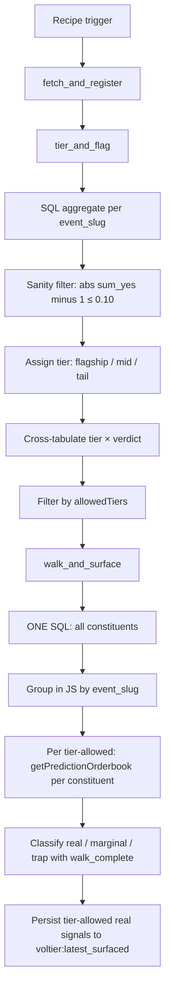

# Volume-Tier Trap Filter Workflow

Workflow submission with artifact at `workflows/volume-tier-trap-filter/references/volume-tier-trap-filter@latest.ts`.

## What it does

- Implements the count-vs-dollar reframe from the polymarket-edge research as a runnable filter: same fetch + sanity filter pipeline as `negrisk-event-arbitrage-surfacer`, plus per-event dollar-volume tier classification.
- Computes a tier × verdict cross-tabulation across ALL flagged events (not just tier-allowed ones), persisted to KV for cross-day trend analysis. The `allowedTiersDollarShare` metric should hover near 1.0 in steady state if the empirical finding (95.9% of dollar volume in flagship-tier events) holds for the operator's observation window.
- Depth-walks only tier-allowed events to keep scan cost proportional to deployable opportunity.
- Surfaces only tier-allowed real signals, which are then consumed by the downstream `negrisk-maker-executor` recipe.

## Capability contract

- Trigger: recurring schedule `5 14 * * *` in `UTC` (5 minutes after the upstream surfacer recipe).
- Inputs:
  - `limit` (default 100)
  - `feeBufferBp` (default 50)
  - `minConstituents` (default 3)
  - `maxAbsDeviation` (default 0.10), sanity filter on `|sum_yes - 1.0|`
  - `flagshipFloorUsd` (default 1,000,000)
  - `midFloorUsd` (default 100,000)
  - `allowFlagship` (default `true`)
  - `allowMid` (default `false`)
  - `allowTail` (default `false`)
  - `depthSize1`/`2`/`3` (default 50/500/5000)
  - `snapshotPrefix` (default `"voltier:"`)
- Outputs:
  - `voltier:latest_breakdown`, full tier × verdict cross-tabulation including dollar shares (KV)
  - `voltier:latest_surfaced`, tier-allowed real signals (KV), consumed by `negrisk-maker-executor`
  - `/workspace/scratch/voltier_filtered.json`, tier-allowed flagged events pre-walk (artifact)
  - `/workspace/scratch/voltier_classified.json`, post-walk classification (artifact)
  - `/workspace/scratch/voltier_summary.md`, human-readable summary (artifact)
- Side effects:
  - reads Polymarket gamma + CLOB/orderbook data
  - writes KV under `voltier:*` namespace and local run artifacts
  - does NOT submit orders, does NOT manage Struct watchers
- Failure modes:
  - no flagship-tier events flag on a given run (expected most days; the dollar-tier reframe predicts exactly this concentration pattern)
  - depth-walk timeout on a constituent (event excluded from this run; same conservative classification as the surfacer)
  - tier classification edge case where `ev_vol` crosses tier boundary mid-run (re-classified on next run)

## Workflow steps

1. **fetch_and_register**, Same response-shape handling as `negrisk-event-arbitrage-surfacer`: detect `result.table` and use auto-registered name; fall back to manual write+register for inline arrays. Persist table name to `voltier:current_table` KV.
2. **tier_and_flag**, Read table name from KV. SQL aggregate `sum_yes` + `ev_vol` per `event_slug`. Apply `|sum_yes - 1.0| ≤ maxAbsDeviation` sanity filter. Assign each flagged event to a tier (`flagship` ≥ `flagshipFloorUsd`, `mid` ≥ `midFloorUsd`, else `tail`). Filter by `allowedTiers` config. Persist tier × verdict breakdown and filtered subset to KV + artifact.
3. **walk_and_surface**, Single SQL fetch of all constituents (no per-event WHERE-clause; same injection-elimination as the surfacer). Group in JS. For each tier-allowed flagged event, walk constituent depth, classify with walk-complete check, persist surfaced real signals to `voltier:latest_surfaced` for downstream consumption.

## Execution diagram

## Setup

1. Use `workflows/volume-tier-trap-filter/references/volume-tier-trap-filter@latest.ts` as the source artifact.
2. Validate with `workflow validate volume-tier-trap-filter`.
3. Schedule the companion recipe at `5 14 * * *` UTC (5 minutes after the surfacer).
4. Start with `allowFlagship: true, allowMid: false, allowTail: false` (the empirical-finding-matched defaults).
5. Monitor `voltier:latest_breakdown` over multiple runs to validate the dollar-vs-count gap on the operator's observation window.

## Security and permissions

- `security.permissions`: read-market-data, read-orderbook, write-run-artifacts, write-local-state-file, read/write-kv.
- Scope controls: allowlist host tools per step; avoid wildcard permissions.
- Read/surface only, no trade execution.
- Safe to run on a daily schedule.

## Evidence

- Source artifact: `workflows/volume-tier-trap-filter/references/volume-tier-trap-filter@latest.ts`.
- Companion strategy: `strategies/predictions/strategy-polymarket-negrisk-basket-arbitrage.md` (bundle strategy, Layer 2).
- Companion recipe: `recipes/predictions/recipe-volume-tier-trap-filter.md`.
- Underlying empirical finding: [polymarket-edge](https://github.com/harrywinter06-code/polymarket-edge) `MICROSTRUCTURE.md` "Volume-weighted re-analysis" section and `scripts/volume_weighted_trap_rate.py`. 500-event scan, 19/500 flagged. Count-based trap rate 63.2%, dollar-weighted trap rate 0.012%, World Cup `real` event carried 95.9% of $1.15B flagged dollar volume.

## Backlinks

- [Pack README](../../README.md)
- Category: `workflows/predictions/` (resolves to `docs/categories/workflows.md` when merged into `awesome-gina`)
